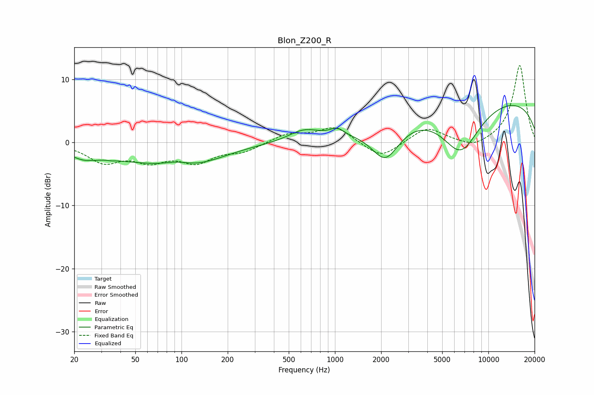

# Blon_Z200_R
See [usage instructions](https://github.com/jaakkopasanen/AutoEq#usage) for more options and info.

### Parametric EQs
Apply preamp of -6.0 dB when using parametric equalizer.

|   # | Type    |   Fc (Hz) |    Q |   Gain (dB) |
|-----|---------|-----------|------|-------------|
|   1 | Peaking |        23 | 1.65 |        -1.2 |
|   2 | Peaking |        35 | 5.79 |        -0.1 |
|   3 | Peaking |        54 | 0.43 |        -2.4 |
|   4 | Peaking |        94 | 1.67 |         0.8 |
|   5 | Peaking |       121 | 0.69 |        -2.3 |
|   6 | Peaking |       630 | 1.41 |         1.7 |
|   7 | Peaking |      1034 | 3.19 |         1.2 |
|   8 | Peaking |      2133 | 1.52 |        -5.8 |
|   9 | Peaking |      6597 | 1.05 |        -8.1 |
|  10 | Peaking |      9214 | 0.18 |         7.4 |

### Fixed Band EQs
When using fixed band (also called graphic) equalizer, apply preamp of **-12.3 dB** (if available) and set gains manually with these parameters.

|   # | Type    |   Fc (Hz) |    Q |   Gain (dB) |
|-----|---------|-----------|------|-------------|
|   1 | Peaking |        31 | 1.41 |        -2.9 |
|   2 | Peaking |        62 | 1.41 |        -2.5 |
|   3 | Peaking |       125 | 1.41 |        -2.8 |
|   4 | Peaking |       250 | 1.41 |        -1.3 |
|   5 | Peaking |       500 | 1.41 |         1.4 |
|   6 | Peaking |      1000 | 1.41 |         2.5 |
|   7 | Peaking |      2000 | 1.41 |        -2.6 |
|   8 | Peaking |      4000 | 1.41 |         2.4 |
|   9 | Peaking |      8000 | 1.41 |        -1.1 |
|  10 | Peaking |     16000 | 1.41 |        12.3 |

### Graphs

