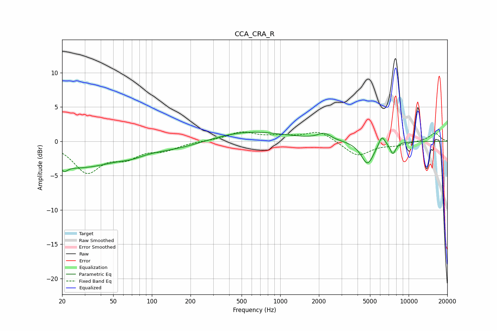

# CCA_CRA_R
See [usage instructions](https://github.com/jaakkopasanen/AutoEq#usage) for more options and info.

### Parametric EQs
Apply preamp of -1.4 dB when using parametric equalizer.

|   # | Type    |   Fc (Hz) |    Q |   Gain (dB) |
|-----|---------|-----------|------|-------------|
|   1 | Peaking |        21 | 5.87 |        -3.8 |
|   2 | Peaking |        21 | 6    |         2.9 |
|   3 | Peaking |        27 | 0.46 |        -3.7 |
|   4 | Peaking |        69 | 1.62 |        -0.5 |
|   5 | Peaking |       164 | 0.58 |        -1   |
|   6 | Peaking |       540 | 0.47 |         1.6 |
|   7 | Peaking |      2199 | 2.88 |         0.9 |
|   8 | Peaking |      4780 | 2.77 |        -3.3 |
|   9 | Peaking |      6183 | 5.53 |         1.5 |
|  10 | Peaking |      7541 | 6    |        -1.7 |

### Fixed Band EQs
When using fixed band (also called graphic) equalizer, apply preamp of **-1.5 dB** (if available) and set gains manually with these parameters.

|   # | Type    |   Fc (Hz) |    Q |   Gain (dB) |
|-----|---------|-----------|------|-------------|
|   1 | Peaking |        31 | 1.41 |        -4.3 |
|   2 | Peaking |        62 | 1.41 |        -2   |
|   3 | Peaking |       125 | 1.41 |        -1.1 |
|   4 | Peaking |       250 | 1.41 |         0.1 |
|   5 | Peaking |       500 | 1.41 |         1.3 |
|   6 | Peaking |      1000 | 1.41 |         0.6 |
|   7 | Peaking |      2000 | 1.41 |         1.5 |
|   8 | Peaking |      4000 | 1.41 |        -2.2 |
|   9 | Peaking |      8000 | 1.41 |        -0.5 |
|  10 | Peaking |     16000 | 1.41 |         1.2 |

### Graphs

