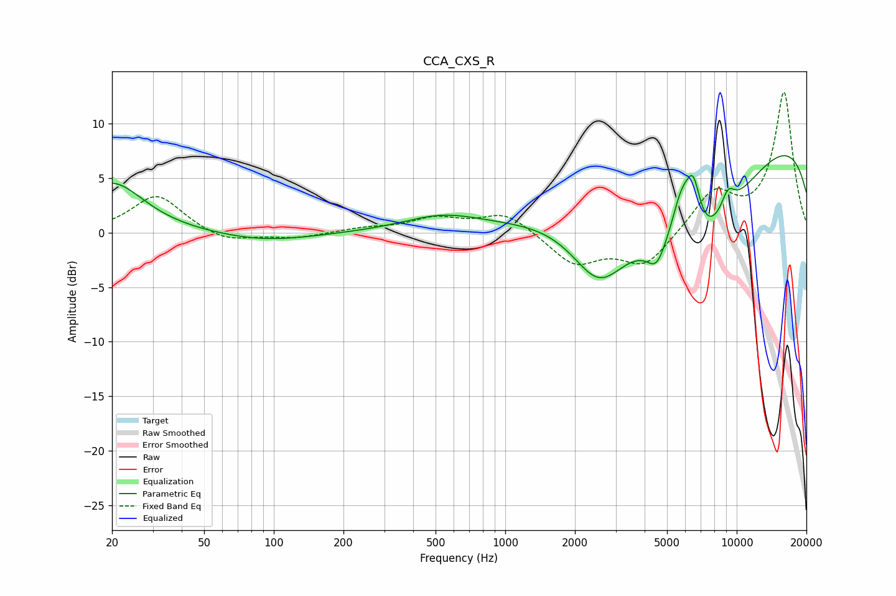

# CCA_CXS_R
See [usage instructions](https://github.com/jaakkopasanen/AutoEq#usage) for more options and info.

### Parametric EQs
Apply preamp of -7.2 dB when using parametric equalizer.

|   # | Type    |   Fc (Hz) |    Q |   Gain (dB) |
|-----|---------|-----------|------|-------------|
|   1 | Peaking |        20 | 1.05 |         4.6 |
|   2 | Peaking |        91 | 0.68 |        -0.8 |
|   3 | Peaking |       532 | 0.84 |         1.4 |
|   4 | Peaking |      2536 | 1.19 |        -5.8 |
|   5 | Peaking |      4503 | 3.56 |        -2   |
|   6 | Peaking |      5780 | 2.79 |         5.3 |
|   7 | Peaking |      6391 | 0.55 |       -12.4 |
|   8 | Peaking |      6493 | 4.32 |         4.4 |
|   9 | Peaking |      9165 | 4.04 |         2   |
|  10 | Peaking |     10000 | 0.18 |        11   |

### Fixed Band EQs
When using fixed band (also called graphic) equalizer, apply preamp of **-13.0 dB** (if available) and set gains manually with these parameters.

|   # | Type    |   Fc (Hz) |    Q |   Gain (dB) |
|-----|---------|-----------|------|-------------|
|   1 | Peaking |        31 | 1.41 |         3.5 |
|   2 | Peaking |        62 | 1.41 |        -1   |
|   3 | Peaking |       125 | 1.41 |        -0.5 |
|   4 | Peaking |       250 | 1.41 |         0.4 |
|   5 | Peaking |       500 | 1.41 |         1.2 |
|   6 | Peaking |      1000 | 1.41 |         1.8 |
|   7 | Peaking |      2000 | 1.41 |        -2.9 |
|   8 | Peaking |      4000 | 1.41 |        -3   |
|   9 | Peaking |      8000 | 1.41 |         3.6 |
|  10 | Peaking |     16000 | 1.41 |        12.8 |

### Graphs

