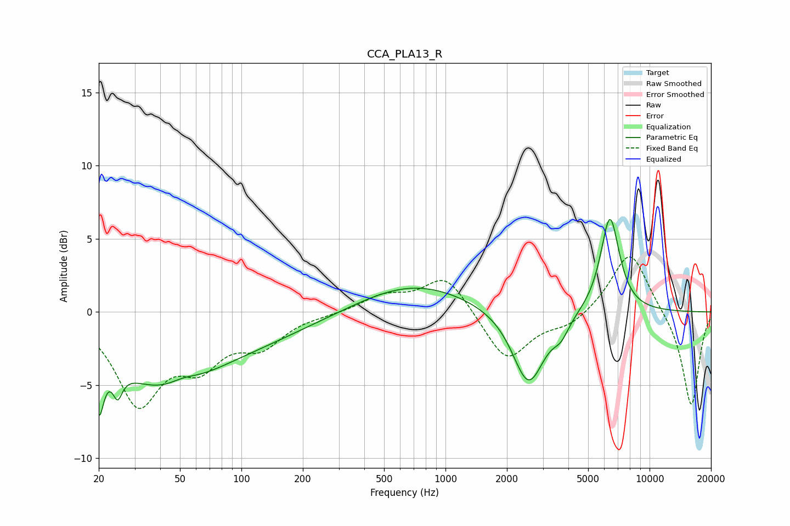

# CCA_PLA13_R
See [usage instructions](https://github.com/jaakkopasanen/AutoEq#usage) for more options and info.

### Parametric EQs
Apply preamp of -6.4 dB when using parametric equalizer.

|   # | Type    |   Fc (Hz) |    Q |   Gain (dB) |
|-----|---------|-----------|------|-------------|
|   1 | Peaking |        20 | 6    |        -3.9 |
|   2 | Peaking |        25 | 5.86 |         3.1 |
|   3 | Peaking |        25 | 5.88 |        -4.9 |
|   4 | Peaking |        40 | 0.55 |        -4.7 |
|   5 | Peaking |        52 | 1.94 |         0.5 |
|   6 | Peaking |       124 | 0.46 |        -1.3 |
|   7 | Peaking |       698 | 0.52 |         2   |
|   8 | Peaking |      2551 | 1.81 |        -5.1 |
|   9 | Peaking |      3682 | 3.6  |        -1   |
|  10 | Peaking |      6393 | 2.94 |         6.6 |

### Fixed Band EQs
When using fixed band (also called graphic) equalizer, apply preamp of **-3.9 dB** (if available) and set gains manually with these parameters.

|   # | Type    |   Fc (Hz) |    Q |   Gain (dB) |
|-----|---------|-----------|------|-------------|
|   1 | Peaking |        31 | 1.41 |        -6   |
|   2 | Peaking |        62 | 1.41 |        -3   |
|   3 | Peaking |       125 | 1.41 |        -2   |
|   4 | Peaking |       250 | 1.41 |        -0.1 |
|   5 | Peaking |       500 | 1.41 |         1   |
|   6 | Peaking |      1000 | 1.41 |         2.6 |
|   7 | Peaking |      2000 | 1.41 |        -3.4 |
|   8 | Peaking |      4000 | 1.41 |        -0.9 |
|   9 | Peaking |      8000 | 1.41 |         4.3 |
|  10 | Peaking |     16000 | 1.41 |        -6.5 |

### Graphs

