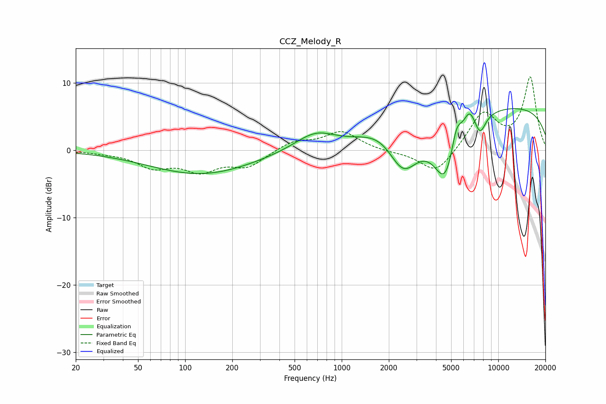

# CCZ_Melody_R
See [usage instructions](https://github.com/jaakkopasanen/AutoEq#usage) for more options and info.

### Parametric EQs
Apply preamp of -6.3 dB when using parametric equalizer.

|   # | Type    |   Fc (Hz) |    Q |   Gain (dB) |
|-----|---------|-----------|------|-------------|
|   1 | Peaking |       127 | 0.43 |        -3.6 |
|   2 | Peaking |       696 | 1.04 |         3.3 |
|   3 | Peaking |       802 | 1.03 |        -0.8 |
|   4 | Peaking |      1838 | 1.04 |         2.2 |
|   5 | Peaking |      2462 | 1.38 |        -6.9 |
|   6 | Peaking |      4606 | 1.78 |        -9.1 |
|   7 | Peaking |      5405 | 4.08 |         3.7 |
|   8 | Peaking |      6542 | 3.77 |         2.6 |
|   9 | Peaking |      7663 | 3.8  |        -2.8 |
|  10 | Peaking |     10000 | 0.18 |         6.7 |

### Fixed Band EQs
When using fixed band (also called graphic) equalizer, apply preamp of **-11.0 dB** (if available) and set gains manually with these parameters.

|   # | Type    |   Fc (Hz) |    Q |   Gain (dB) |
|-----|---------|-----------|------|-------------|
|   1 | Peaking |        31 | 1.41 |        -0.2 |
|   2 | Peaking |        62 | 1.41 |        -2.3 |
|   3 | Peaking |       125 | 1.41 |        -2.8 |
|   4 | Peaking |       250 | 1.41 |        -2.3 |
|   5 | Peaking |       500 | 1.41 |         1.4 |
|   6 | Peaking |      1000 | 1.41 |         2.7 |
|   7 | Peaking |      2000 | 1.41 |        -0.2 |
|   8 | Peaking |      4000 | 1.41 |        -3.6 |
|   9 | Peaking |      8000 | 1.41 |         5.5 |
|  10 | Peaking |     16000 | 1.41 |        10.7 |

### Graphs

