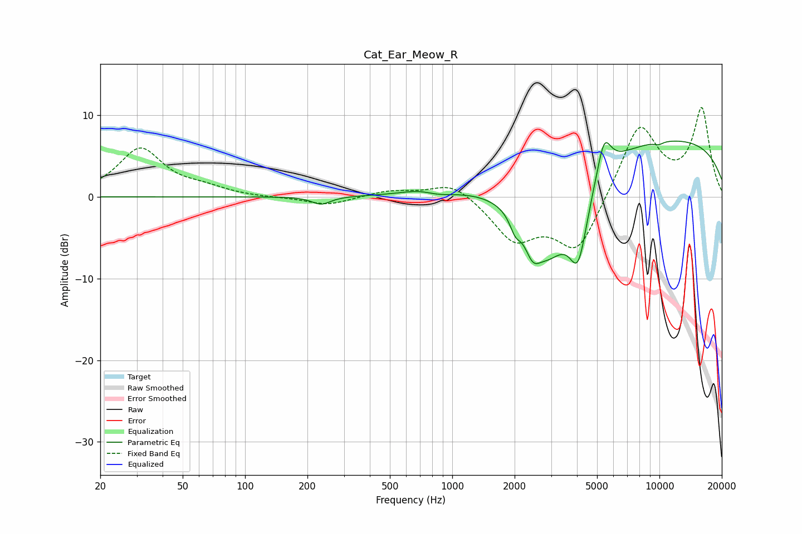

# Cat_Ear_Meow_R
See [usage instructions](https://github.com/jaakkopasanen/AutoEq#usage) for more options and info.

### Parametric EQs
Apply preamp of -6.9 dB when using parametric equalizer.

|   # | Type    |   Fc (Hz) |    Q |   Gain (dB) |
|-----|---------|-----------|------|-------------|
|   1 | Peaking |       233 | 3.17 |        -1   |
|   2 | Peaking |       754 | 1.46 |         1.1 |
|   3 | Peaking |       829 | 1.78 |        -1   |
|   4 | Peaking |      2014 | 5.55 |        -1.8 |
|   5 | Peaking |      2441 | 3.79 |        -2.9 |
|   6 | Peaking |      2910 | 1.13 |       -10.6 |
|   7 | Peaking |      4056 | 3.03 |        -8.3 |
|   8 | Peaking |      5405 | 4.09 |         4.6 |
|   9 | Peaking |      9011 | 0.18 |         7.5 |
|  10 | Peaking |      9907 | 5.6  |        -0.3 |

### Fixed Band EQs
When using fixed band (also called graphic) equalizer, apply preamp of **-11.0 dB** (if available) and set gains manually with these parameters.

|   # | Type    |   Fc (Hz) |    Q |   Gain (dB) |
|-----|---------|-----------|------|-------------|
|   1 | Peaking |        31 | 1.41 |         5.8 |
|   2 | Peaking |        62 | 1.41 |         0.8 |
|   3 | Peaking |       125 | 1.41 |        -0.1 |
|   4 | Peaking |       250 | 1.41 |        -1   |
|   5 | Peaking |       500 | 1.41 |         0.8 |
|   6 | Peaking |      1000 | 1.41 |         2   |
|   7 | Peaking |      2000 | 1.41 |        -5   |
|   8 | Peaking |      4000 | 1.41 |        -6.8 |
|   9 | Peaking |      8000 | 1.41 |         9   |
|  10 | Peaking |     16000 | 1.41 |        10.6 |

### Graphs

