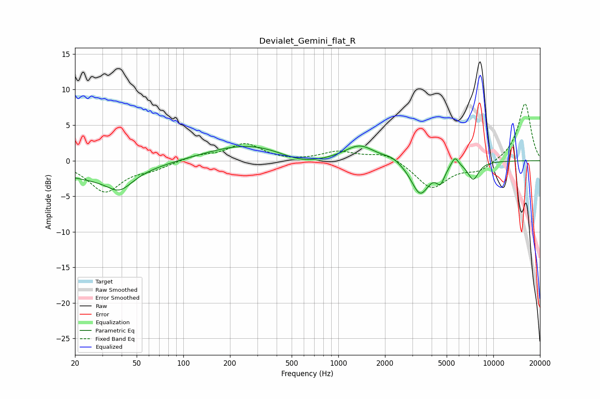

# Devialet_Gemini_flat_R
See [usage instructions](https://github.com/jaakkopasanen/AutoEq#usage) for more options and info.

### Parametric EQs
Apply preamp of -2.2 dB when using parametric equalizer.

|   # | Type    |   Fc (Hz) |    Q |   Gain (dB) |
|-----|---------|-----------|------|-------------|
|   1 | Peaking |        26 | 0.49 |        -2.3 |
|   2 | Peaking |        39 | 1.76 |        -2.3 |
|   3 | Peaking |       268 | 0.53 |         2.4 |
|   4 | Peaking |       580 | 0.95 |        -1.3 |
|   5 | Peaking |      1374 | 1.48 |         2.2 |
|   6 | Peaking |      2212 | 2.62 |         0.6 |
|   7 | Peaking |      3373 | 2.4  |        -4.7 |
|   8 | Peaking |      4559 | 5.1  |        -2.1 |
|   9 | Peaking |      5651 | 5.99 |         1.4 |
|  10 | Peaking |      7422 | 3.82 |        -2.5 |

### Fixed Band EQs
When using fixed band (also called graphic) equalizer, apply preamp of **-8.1 dB** (if available) and set gains manually with these parameters.

|   # | Type    |   Fc (Hz) |    Q |   Gain (dB) |
|-----|---------|-----------|------|-------------|
|   1 | Peaking |        31 | 1.41 |        -4.3 |
|   2 | Peaking |        62 | 1.41 |        -1   |
|   3 | Peaking |       125 | 1.41 |         0.7 |
|   4 | Peaking |       250 | 1.41 |         2.3 |
|   5 | Peaking |       500 | 1.41 |        -0.1 |
|   6 | Peaking |      1000 | 1.41 |         1.2 |
|   7 | Peaking |      2000 | 1.41 |         1.2 |
|   8 | Peaking |      4000 | 1.41 |        -3.9 |
|   9 | Peaking |      8000 | 1.41 |        -1.4 |
|  10 | Peaking |     16000 | 1.41 |         8.1 |

### Graphs

