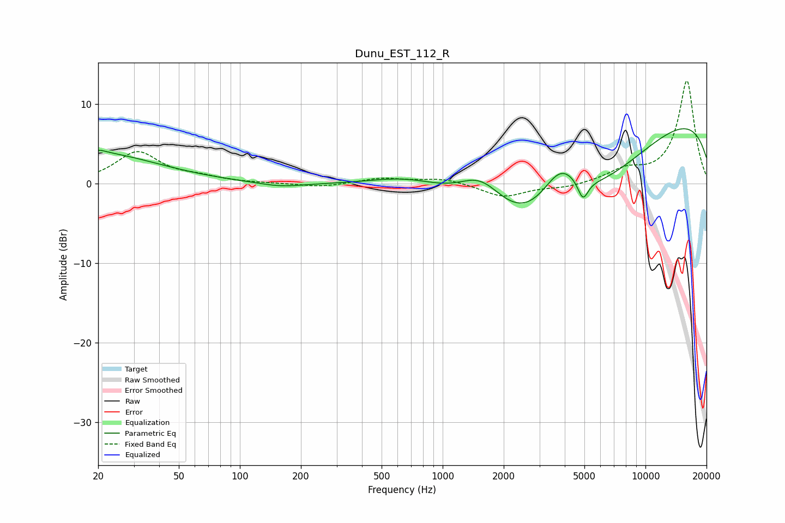

# Dunu_EST_112_R
See [usage instructions](https://github.com/jaakkopasanen/AutoEq#usage) for more options and info.

### Parametric EQs
Apply preamp of -7.0 dB when using parametric equalizer.

|   # | Type    |   Fc (Hz) |    Q |   Gain (dB) |
|-----|---------|-----------|------|-------------|
|   1 | Peaking |        20 | 0.47 |         3.7 |
|   2 | Peaking |        20 | 1.89 |         0.3 |
|   3 | Peaking |        20 | 5.6  |         0.2 |
|   4 | Peaking |       159 | 1.29 |        -0.5 |
|   5 | Peaking |       730 | 0.6  |         4.4 |
|   6 | Peaking |      1548 | 1.1  |         5.6 |
|   7 | Peaking |      3415 | 0.27 |       -16.1 |
|   8 | Peaking |      3813 | 1.29 |         7.3 |
|   9 | Peaking |      4918 | 5.42 |        -2.5 |
|  10 | Peaking |      9976 | 0.22 |        12.5 |

### Fixed Band EQs
When using fixed band (also called graphic) equalizer, apply preamp of **-13.0 dB** (if available) and set gains manually with these parameters.

|   # | Type    |   Fc (Hz) |    Q |   Gain (dB) |
|-----|---------|-----------|------|-------------|
|   1 | Peaking |        31 | 1.41 |         3.9 |
|   2 | Peaking |        62 | 1.41 |         0.6 |
|   3 | Peaking |       125 | 1.41 |         0   |
|   4 | Peaking |       250 | 1.41 |        -0.4 |
|   5 | Peaking |       500 | 1.41 |         0.7 |
|   6 | Peaking |      1000 | 1.41 |         0.7 |
|   7 | Peaking |      2000 | 1.41 |        -1.7 |
|   8 | Peaking |      4000 | 1.41 |        -0.5 |
|   9 | Peaking |      8000 | 1.41 |         1.5 |
|  10 | Peaking |     16000 | 1.41 |        12.9 |

### Graphs

