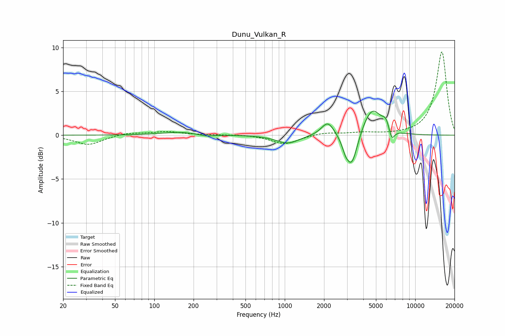

# Dunu_Vulkan_R
See [usage instructions](https://github.com/jaakkopasanen/AutoEq#usage) for more options and info.

### Parametric EQs
Apply preamp of -2.8 dB when using parametric equalizer.

|   # | Type    |   Fc (Hz) |    Q |   Gain (dB) |
|-----|---------|-----------|------|-------------|
|   1 | Peaking |       154 | 1.06 |         0.3 |
|   2 | Peaking |       251 | 2.69 |        -0.2 |
|   3 | Peaking |      1053 | 1.65 |        -1   |
|   4 | Peaking |      2140 | 2.88 |         1.7 |
|   5 | Peaking |      2914 | 5.73 |        -0.9 |
|   6 | Peaking |      3260 | 3.3  |        -3.7 |
|   7 | Peaking |      4224 | 2.6  |         0.6 |
|   8 | Peaking |      4759 | 2.2  |         2.6 |
|   9 | Peaking |      5976 | 4.46 |         1.2 |
|  10 | Peaking |      6595 | 6    |        -1.5 |

### Fixed Band EQs
When using fixed band (also called graphic) equalizer, apply preamp of **-9.6 dB** (if available) and set gains manually with these parameters.

|   # | Type    |   Fc (Hz) |    Q |   Gain (dB) |
|-----|---------|-----------|------|-------------|
|   1 | Peaking |        31 | 1.41 |        -1.1 |
|   2 | Peaking |        62 | 1.41 |         0.3 |
|   3 | Peaking |       125 | 1.41 |         0.4 |
|   4 | Peaking |       250 | 1.41 |         0   |
|   5 | Peaking |       500 | 1.41 |         0.1 |
|   6 | Peaking |      1000 | 1.41 |        -1   |
|   7 | Peaking |      2000 | 1.41 |         0.3 |
|   8 | Peaking |      4000 | 1.41 |         0.3 |
|   9 | Peaking |      8000 | 1.41 |         0   |
|  10 | Peaking |     16000 | 1.41 |         9.6 |

### Graphs

