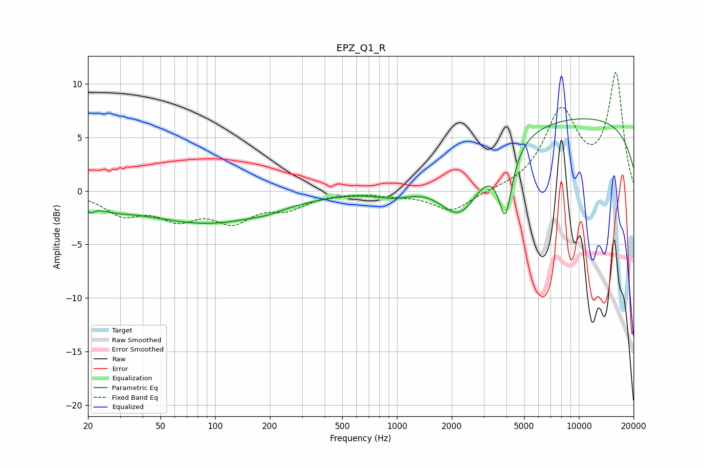

# EPZ_Q1_R
See [usage instructions](https://github.com/jaakkopasanen/AutoEq#usage) for more options and info.

### Parametric EQs
Apply preamp of -6.8 dB when using parametric equalizer.

|   # | Type    |   Fc (Hz) |    Q |   Gain (dB) |
|-----|---------|-----------|------|-------------|
|   1 | Peaking |        20 | 1.74 |         0.6 |
|   2 | Peaking |        20 | 5.95 |        -1   |
|   3 | Peaking |        23 | 2.37 |        -0.2 |
|   4 | Peaking |        26 | 1.15 |        -0.9 |
|   5 | Peaking |        91 | 0.4  |        -3   |
|   6 | Peaking |       194 | 2.02 |        -0.2 |
|   7 | Peaking |       974 | 1.27 |        -1   |
|   8 | Peaking |      2232 | 1.21 |        -5.4 |
|   9 | Peaking |      3943 | 3.76 |        -6.2 |
|  10 | Peaking |      9395 | 0.18 |         6.9 |

### Fixed Band EQs
When using fixed band (also called graphic) equalizer, apply preamp of **-11.2 dB** (if available) and set gains manually with these parameters.

|   # | Type    |   Fc (Hz) |    Q |   Gain (dB) |
|-----|---------|-----------|------|-------------|
|   1 | Peaking |        31 | 1.41 |        -2   |
|   2 | Peaking |        62 | 1.41 |        -2.2 |
|   3 | Peaking |       125 | 1.41 |        -2.5 |
|   4 | Peaking |       250 | 1.41 |        -1.4 |
|   5 | Peaking |       500 | 1.41 |        -0   |
|   6 | Peaking |      1000 | 1.41 |        -0.3 |
|   7 | Peaking |      2000 | 1.41 |        -1.9 |
|   8 | Peaking |      4000 | 1.41 |         0   |
|   9 | Peaking |      8000 | 1.41 |         7.2 |
|  10 | Peaking |     16000 | 1.41 |        10.8 |

### Graphs

