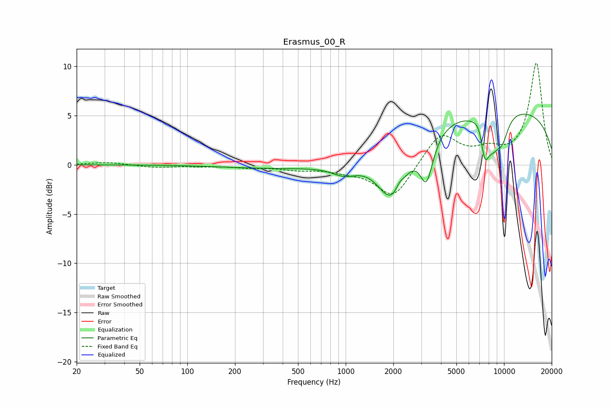

# Erasmus_00_R
See [usage instructions](https://github.com/jaakkopasanen/AutoEq#usage) for more options and info.

### Parametric EQs
Apply preamp of -5.2 dB when using parametric equalizer.

|   # | Type    |   Fc (Hz) |    Q |   Gain (dB) |
|-----|---------|-----------|------|-------------|
|   1 | Peaking |       577 | 0.31 |        -0.5 |
|   2 | Peaking |       983 | 1.74 |        -1.1 |
|   3 | Peaking |      1964 | 1.49 |        -5.7 |
|   4 | Peaking |      2186 | 5.66 |         0.7 |
|   5 | Peaking |      3239 | 3.38 |        -4.4 |
|   6 | Peaking |      7072 | 4.43 |         1.3 |
|   7 | Peaking |      7530 | 4.58 |        -4   |
|   8 | Peaking |      8556 | 2.84 |        -2.6 |
|   9 | Peaking |      8895 | 0.18 |         5.9 |
|  10 | Peaking |      9779 | 3.21 |        -2.2 |

### Fixed Band EQs
When using fixed band (also called graphic) equalizer, apply preamp of **-10.4 dB** (if available) and set gains manually with these parameters.

|   # | Type    |   Fc (Hz) |    Q |   Gain (dB) |
|-----|---------|-----------|------|-------------|
|   1 | Peaking |        31 | 1.41 |         0.3 |
|   2 | Peaking |        62 | 1.41 |        -0.3 |
|   3 | Peaking |       125 | 1.41 |        -0.1 |
|   4 | Peaking |       250 | 1.41 |        -0.2 |
|   5 | Peaking |       500 | 1.41 |        -0.4 |
|   6 | Peaking |      1000 | 1.41 |        -0.5 |
|   7 | Peaking |      2000 | 1.41 |        -3.4 |
|   8 | Peaking |      4000 | 1.41 |         3.2 |
|   9 | Peaking |      8000 | 1.41 |         1.2 |
|  10 | Peaking |     16000 | 1.41 |        10.3 |

### Graphs

