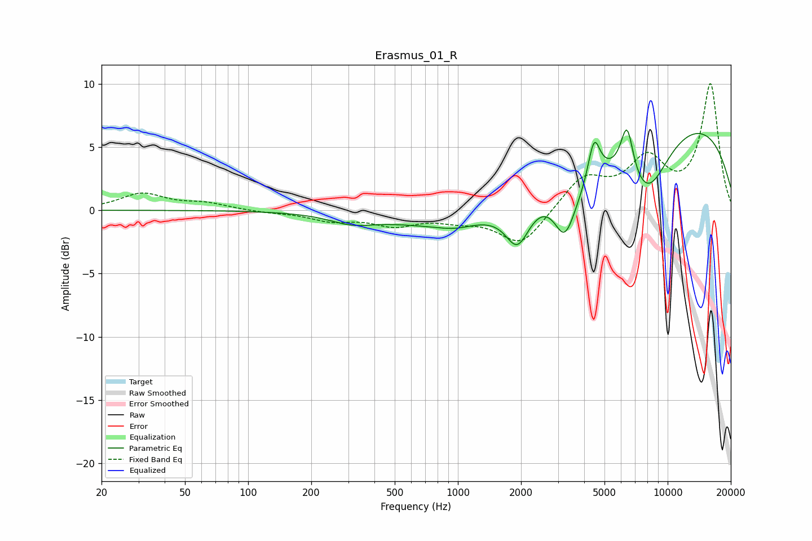

# Erasmus_01_R
See [usage instructions](https://github.com/jaakkopasanen/AutoEq#usage) for more options and info.

### Parametric EQs
Apply preamp of -6.5 dB when using parametric equalizer.

|   # | Type    |   Fc (Hz) |    Q |   Gain (dB) |
|-----|---------|-----------|------|-------------|
|   1 | Peaking |       311 | 1.38 |        -0.7 |
|   2 | Peaking |       971 | 1.65 |        -0.4 |
|   3 | Peaking |      1925 | 2.46 |        -3.3 |
|   4 | Peaking |      3231 | 2.82 |        -3.7 |
|   5 | Peaking |      3253 | 0.18 |        -3.2 |
|   6 | Peaking |      3821 | 1.49 |        -1.4 |
|   7 | Peaking |      4459 | 4.93 |         3.3 |
|   8 | Peaking |      6402 | 4.54 |         4   |
|   9 | Peaking |      7950 | 1.2  |        -5.1 |
|  10 | Peaking |      8646 | 0.22 |         9.6 |

### Fixed Band EQs
When using fixed band (also called graphic) equalizer, apply preamp of **-10.1 dB** (if available) and set gains manually with these parameters.

|   # | Type    |   Fc (Hz) |    Q |   Gain (dB) |
|-----|---------|-----------|------|-------------|
|   1 | Peaking |        31 | 1.41 |         1.3 |
|   2 | Peaking |        62 | 1.41 |         0.5 |
|   3 | Peaking |       125 | 1.41 |        -0.2 |
|   4 | Peaking |       250 | 1.41 |        -0.7 |
|   5 | Peaking |       500 | 1.41 |        -1.1 |
|   6 | Peaking |      1000 | 1.41 |        -0.6 |
|   7 | Peaking |      2000 | 1.41 |        -2.8 |
|   8 | Peaking |      4000 | 1.41 |         2.5 |
|   9 | Peaking |      8000 | 1.41 |         3.7 |
|  10 | Peaking |     16000 | 1.41 |         9.9 |

### Graphs

