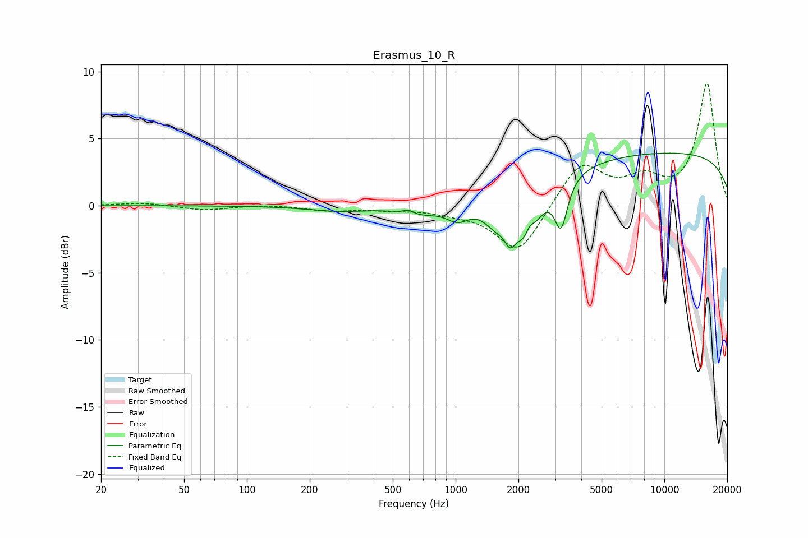

# Erasmus_10_R
See [usage instructions](https://github.com/jaakkopasanen/AutoEq#usage) for more options and info.

### Parametric EQs
Apply preamp of -4.0 dB when using parametric equalizer.

|   # | Type    |   Fc (Hz) |    Q |   Gain (dB) |
|-----|---------|-----------|------|-------------|
|   1 | Peaking |       278 | 0.96 |        -0.4 |
|   2 | Peaking |       595 | 5.94 |         0.3 |
|   3 | Peaking |       675 | 1.45 |        -0.7 |
|   4 | Peaking |      1024 | 2.59 |        -1.1 |
|   5 | Peaking |      1585 | 2.23 |        -1.9 |
|   6 | Peaking |      1825 | 5.92 |        -1.3 |
|   7 | Peaking |      2208 | 2.55 |        -4.1 |
|   8 | Peaking |      2265 | 5.8  |         1.4 |
|   9 | Peaking |      3200 | 4.61 |        -3.5 |
|  10 | Peaking |     10000 | 0.18 |         4   |

### Fixed Band EQs
When using fixed band (also called graphic) equalizer, apply preamp of **-9.2 dB** (if available) and set gains manually with these parameters.

|   # | Type    |   Fc (Hz) |    Q |   Gain (dB) |
|-----|---------|-----------|------|-------------|
|   1 | Peaking |        31 | 1.41 |         0.2 |
|   2 | Peaking |        62 | 1.41 |        -0.3 |
|   3 | Peaking |       125 | 1.41 |         0.1 |
|   4 | Peaking |       250 | 1.41 |        -0.3 |
|   5 | Peaking |       500 | 1.41 |        -0.2 |
|   6 | Peaking |      1000 | 1.41 |        -0.4 |
|   7 | Peaking |      2000 | 1.41 |        -3.6 |
|   8 | Peaking |      4000 | 1.41 |         3.2 |
|   9 | Peaking |      8000 | 1.41 |         1.7 |
|  10 | Peaking |     16000 | 1.41 |         9.1 |

### Graphs

