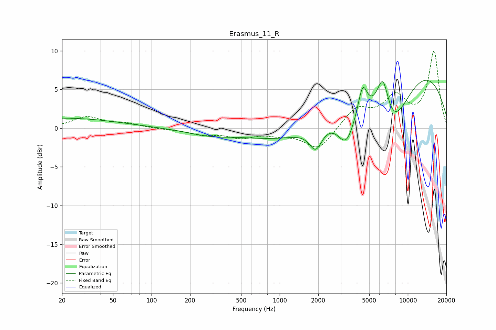

# Erasmus_11_R
See [usage instructions](https://github.com/jaakkopasanen/AutoEq#usage) for more options and info.

### Parametric EQs
Apply preamp of -6.3 dB when using parametric equalizer.

|   # | Type    |   Fc (Hz) |    Q |   Gain (dB) |
|-----|---------|-----------|------|-------------|
|   1 | Peaking |        20 | 0.32 |         1.3 |
|   2 | Peaking |       286 | 0.78 |        -0.8 |
|   3 | Peaking |      1344 | 0.44 |        -2.4 |
|   4 | Peaking |      1912 | 2.8  |        -2.9 |
|   5 | Peaking |      3312 | 2.01 |        -4.6 |
|   6 | Peaking |      4442 | 4.11 |         3.6 |
|   7 | Peaking |      6392 | 2.81 |         5.8 |
|   8 | Peaking |      7076 | 1.91 |        -0.1 |
|   9 | Peaking |      7391 | 0.76 |       -10.8 |
|  10 | Peaking |      8635 | 0.27 |        11.4 |

### Fixed Band EQs
When using fixed band (also called graphic) equalizer, apply preamp of **-10.0 dB** (if available) and set gains manually with these parameters.

|   # | Type    |   Fc (Hz) |    Q |   Gain (dB) |
|-----|---------|-----------|------|-------------|
|   1 | Peaking |        31 | 1.41 |         1.4 |
|   2 | Peaking |        62 | 1.41 |         0.5 |
|   3 | Peaking |       125 | 1.41 |        -0.1 |
|   4 | Peaking |       250 | 1.41 |        -0.7 |
|   5 | Peaking |       500 | 1.41 |        -1.1 |
|   6 | Peaking |      1000 | 1.41 |        -0.6 |
|   7 | Peaking |      2000 | 1.41 |        -2.8 |
|   8 | Peaking |      4000 | 1.41 |         2.5 |
|   9 | Peaking |      8000 | 1.41 |         3.7 |
|  10 | Peaking |     16000 | 1.41 |         9.8 |

### Graphs

