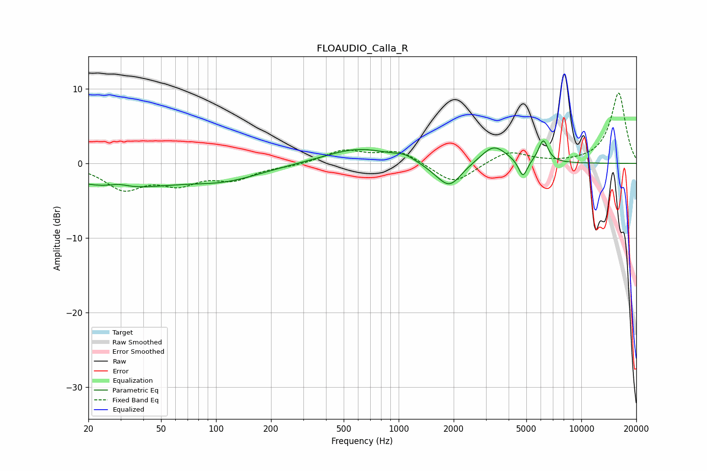

# FLOAUDIO_Calla_R
See [usage instructions](https://github.com/jaakkopasanen/AutoEq#usage) for more options and info.

### Parametric EQs
Apply preamp of -3.1 dB when using parametric equalizer.

|   # | Type    |   Fc (Hz) |    Q |   Gain (dB) |
|-----|---------|-----------|------|-------------|
|   1 | Peaking |        29 | 0.47 |        -3.1 |
|   2 | Peaking |        29 | 2.57 |         0.5 |
|   3 | Peaking |       113 | 0.68 |        -1.8 |
|   4 | Peaking |       608 | 0.76 |         2.1 |
|   5 | Peaking |      1078 | 2.74 |         0.6 |
|   6 | Peaking |      1614 | 1.87 |        -0.6 |
|   7 | Peaking |      1906 | 2.18 |        -3   |
|   8 | Peaking |      3315 | 2.03 |         2.5 |
|   9 | Peaking |      4789 | 5.76 |        -2.4 |
|  10 | Peaking |      6188 | 5.25 |         3   |

### Fixed Band EQs
When using fixed band (also called graphic) equalizer, apply preamp of **-9.5 dB** (if available) and set gains manually with these parameters.

|   # | Type    |   Fc (Hz) |    Q |   Gain (dB) |
|-----|---------|-----------|------|-------------|
|   1 | Peaking |        31 | 1.41 |        -3.2 |
|   2 | Peaking |        62 | 1.41 |        -2.3 |
|   3 | Peaking |       125 | 1.41 |        -1.9 |
|   4 | Peaking |       250 | 1.41 |        -0.3 |
|   5 | Peaking |       500 | 1.41 |         1.7 |
|   6 | Peaking |      1000 | 1.41 |         1.7 |
|   7 | Peaking |      2000 | 1.41 |        -2.8 |
|   8 | Peaking |      4000 | 1.41 |         1.7 |
|   9 | Peaking |      8000 | 1.41 |        -0   |
|  10 | Peaking |     16000 | 1.41 |         9.5 |

### Graphs

