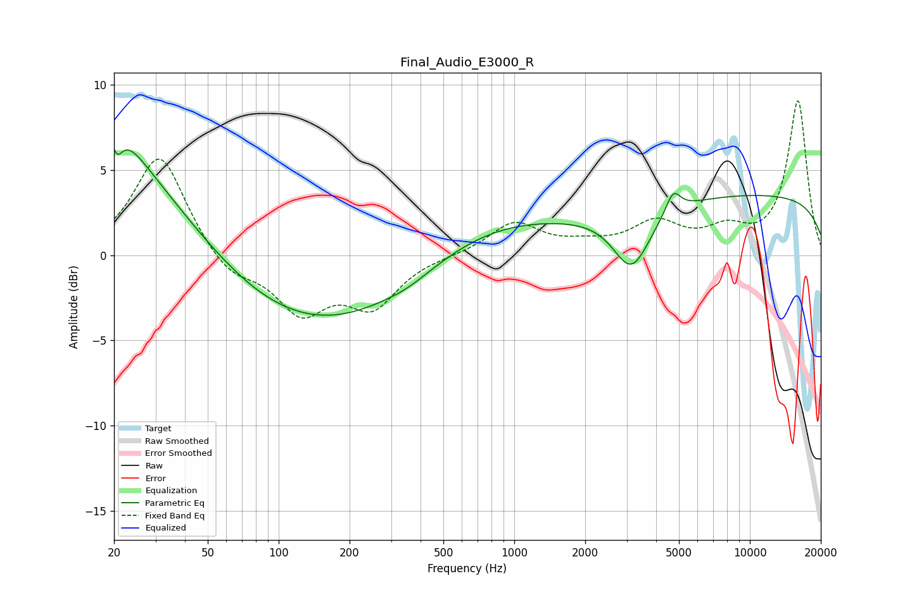

# Final_Audio_E3000_R
See [usage instructions](https://github.com/jaakkopasanen/AutoEq#usage) for more options and info.

### Parametric EQs
Apply preamp of -6.3 dB when using parametric equalizer.

|   # | Type    |   Fc (Hz) |    Q |   Gain (dB) |
|-----|---------|-----------|------|-------------|
|   1 | Peaking |        20 | 5.86 |         1.6 |
|   2 | Peaking |        20 | 0.36 |         6   |
|   3 | Peaking |        20 | 5.89 |        -2.5 |
|   4 | Peaking |        20 | 1.33 |         2.2 |
|   5 | Peaking |       142 | 0.27 |        -4.9 |
|   6 | Peaking |       354 | 1.53 |        -0.3 |
|   7 | Peaking |       682 | 0.43 |         2.5 |
|   8 | Peaking |      3148 | 1.8  |        -3.5 |
|   9 | Peaking |      4726 | 4.48 |         1.3 |
|  10 | Peaking |     10000 | 0.18 |         3.5 |

### Fixed Band EQs
When using fixed band (also called graphic) equalizer, apply preamp of **-9.1 dB** (if available) and set gains manually with these parameters.

|   # | Type    |   Fc (Hz) |    Q |   Gain (dB) |
|-----|---------|-----------|------|-------------|
|   1 | Peaking |        31 | 1.41 |         6   |
|   2 | Peaking |        62 | 1.41 |        -1.3 |
|   3 | Peaking |       125 | 1.41 |        -3.2 |
|   4 | Peaking |       250 | 1.41 |        -2.8 |
|   5 | Peaking |       500 | 1.41 |        -0   |
|   6 | Peaking |      1000 | 1.41 |         1.9 |
|   7 | Peaking |      2000 | 1.41 |         0.5 |
|   8 | Peaking |      4000 | 1.41 |         1.8 |
|   9 | Peaking |      8000 | 1.41 |         1.3 |
|  10 | Peaking |     16000 | 1.41 |         9   |

### Graphs

