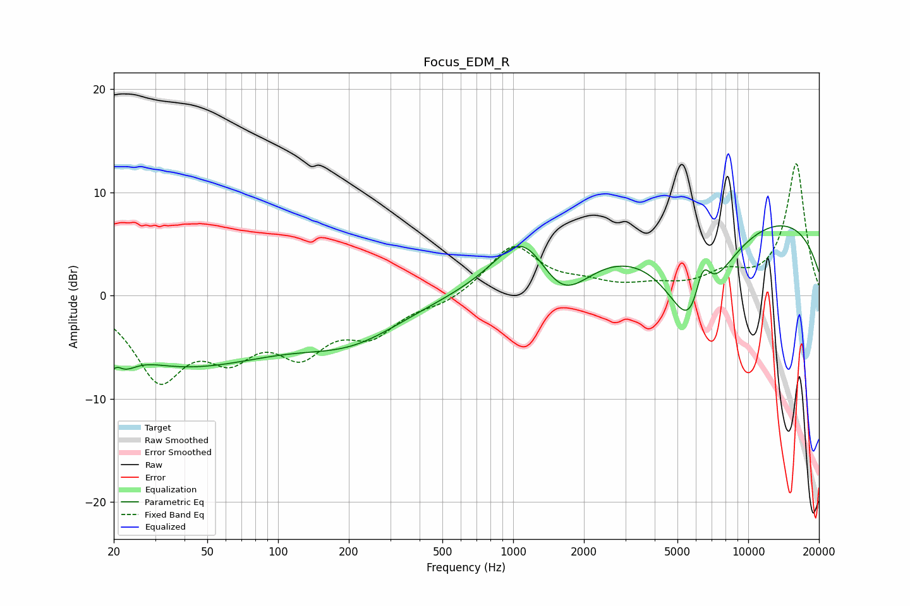

# Focus_EDM_R
See [usage instructions](https://github.com/jaakkopasanen/AutoEq#usage) for more options and info.

### Parametric EQs
Apply preamp of -6.8 dB when using parametric equalizer.

|   # | Type    |   Fc (Hz) |    Q |   Gain (dB) |
|-----|---------|-----------|------|-------------|
|   1 | Peaking |        20 | 2.95 |        -6.1 |
|   2 | Peaking |        20 | 4.33 |         4.2 |
|   3 | Peaking |        27 | 1.99 |         0.3 |
|   4 | Peaking |        39 | 0.34 |        -6.5 |
|   5 | Peaking |       208 | 0.64 |        -3.4 |
|   6 | Peaking |      1105 | 1.18 |         5.5 |
|   7 | Peaking |      1610 | 1.22 |        -4.8 |
|   8 | Peaking |      5905 | 1.17 |       -12.1 |
|   9 | Peaking |      6391 | 3.6  |         5.4 |
|  10 | Peaking |      8691 | 0.18 |         8.6 |

### Fixed Band EQs
When using fixed band (also called graphic) equalizer, apply preamp of **-12.9 dB** (if available) and set gains manually with these parameters.

|   # | Type    |   Fc (Hz) |    Q |   Gain (dB) |
|-----|---------|-----------|------|-------------|
|   1 | Peaking |        31 | 1.41 |        -7.5 |
|   2 | Peaking |        62 | 1.41 |        -4.5 |
|   3 | Peaking |       125 | 1.41 |        -4.7 |
|   4 | Peaking |       250 | 1.41 |        -3.3 |
|   5 | Peaking |       500 | 1.41 |        -0.8 |
|   6 | Peaking |      1000 | 1.41 |         4.8 |
|   7 | Peaking |      2000 | 1.41 |         0.9 |
|   8 | Peaking |      4000 | 1.41 |         0.7 |
|   9 | Peaking |      8000 | 1.41 |         1.8 |
|  10 | Peaking |     16000 | 1.41 |        12.8 |

### Graphs

