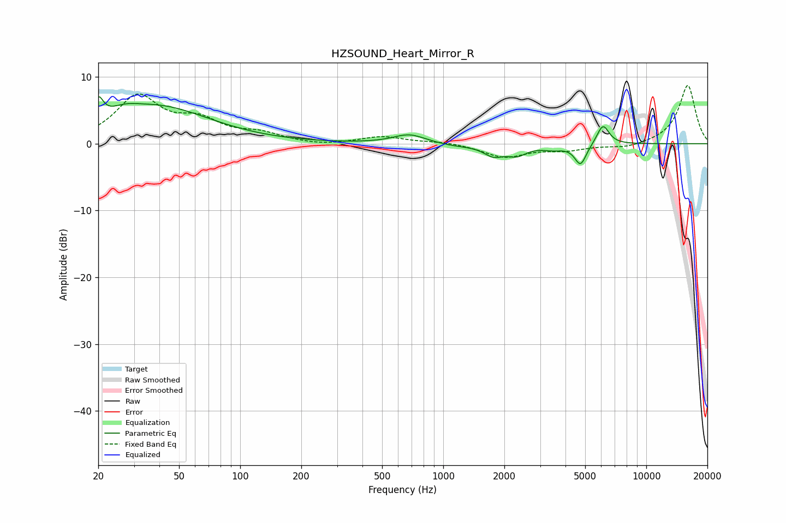

# HZSOUND_Heart_Mirror_R
See [usage instructions](https://github.com/jaakkopasanen/AutoEq#usage) for more options and info.

### Parametric EQs
Apply preamp of -7.1 dB when using parametric equalizer.

|   # | Type    |   Fc (Hz) |    Q |   Gain (dB) |
|-----|---------|-----------|------|-------------|
|   1 | Peaking |        20 | 5.91 |         3.2 |
|   2 | Peaking |        27 | 1.96 |         1.1 |
|   3 | Peaking |        39 | 0.54 |         5.4 |
|   4 | Peaking |       680 | 1.81 |         1.4 |
|   5 | Peaking |      1153 | 1.56 |        -0.4 |
|   6 | Peaking |      1769 | 2.89 |        -1.6 |
|   7 | Peaking |      2305 | 2.9  |        -1.4 |
|   8 | Peaking |      3474 | 2.62 |        -0.7 |
|   9 | Peaking |      4746 | 4.81 |        -3.1 |
|  10 | Peaking |      6117 | 4.58 |         3   |

### Fixed Band EQs
When using fixed band (also called graphic) equalizer, apply preamp of **-8.8 dB** (if available) and set gains manually with these parameters.

|   # | Type    |   Fc (Hz) |    Q |   Gain (dB) |
|-----|---------|-----------|------|-------------|
|   1 | Peaking |        31 | 1.41 |         6.8 |
|   2 | Peaking |        62 | 1.41 |         2.9 |
|   3 | Peaking |       125 | 1.41 |         1.3 |
|   4 | Peaking |       250 | 1.41 |        -0.4 |
|   5 | Peaking |       500 | 1.41 |         1   |
|   6 | Peaking |      1000 | 1.41 |         0.3 |
|   7 | Peaking |      2000 | 1.41 |        -2   |
|   8 | Peaking |      4000 | 1.41 |        -0.9 |
|   9 | Peaking |      8000 | 1.41 |        -0.7 |
|  10 | Peaking |     16000 | 1.41 |         8.8 |

### Graphs

