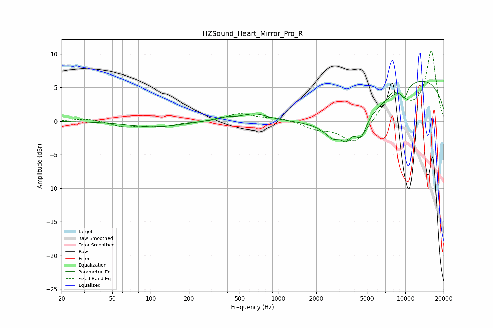

# HZSound_Heart_Mirror_Pro_R
See [usage instructions](https://github.com/jaakkopasanen/AutoEq#usage) for more options and info.

### Parametric EQs
Apply preamp of -6.0 dB when using parametric equalizer.

|   # | Type    |   Fc (Hz) |    Q |   Gain (dB) |
|-----|---------|-----------|------|-------------|
|   1 | Peaking |       107 | 0.73 |        -0.9 |
|   2 | Peaking |       378 | 1.77 |         0.5 |
|   3 | Peaking |       657 | 1.48 |         1   |
|   4 | Peaking |      2721 | 2.27 |        -1.8 |
|   5 | Peaking |      3428 | 4.16 |        -1.5 |
|   6 | Peaking |      3568 | 0.45 |        -6.8 |
|   7 | Peaking |      4474 | 3.23 |        -2.7 |
|   8 | Peaking |      8195 | 0.18 |         7.8 |
|   9 | Peaking |      9678 | 5.97 |        -0.4 |
|  10 | Peaking |      9898 | 5.09 |        -1.3 |

### Fixed Band EQs
When using fixed band (also called graphic) equalizer, apply preamp of **-10.6 dB** (if available) and set gains manually with these parameters.

|   # | Type    |   Fc (Hz) |    Q |   Gain (dB) |
|-----|---------|-----------|------|-------------|
|   1 | Peaking |        31 | 1.41 |         0.5 |
|   2 | Peaking |        62 | 1.41 |        -0.8 |
|   3 | Peaking |       125 | 1.41 |        -0.7 |
|   4 | Peaking |       250 | 1.41 |        -0.1 |
|   5 | Peaking |       500 | 1.41 |         1.1 |
|   6 | Peaking |      1000 | 1.41 |         0.5 |
|   7 | Peaking |      2000 | 1.41 |        -1   |
|   8 | Peaking |      4000 | 1.41 |        -3.5 |
|   9 | Peaking |      8000 | 1.41 |         4.2 |
|  10 | Peaking |     16000 | 1.41 |        10.4 |

### Graphs

