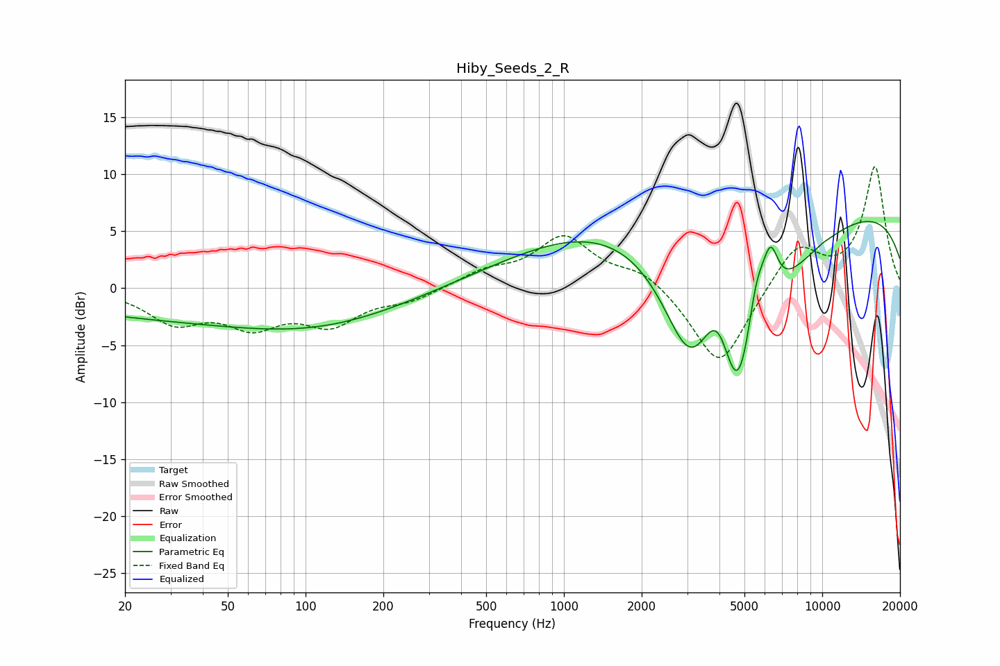

# Hiby_Seeds_2_R
See [usage instructions](https://github.com/jaakkopasanen/AutoEq#usage) for more options and info.

### Parametric EQs
Apply preamp of -5.9 dB when using parametric equalizer.

|   # | Type    |   Fc (Hz) |    Q |   Gain (dB) |
|-----|---------|-----------|------|-------------|
|   1 | Peaking |        44 | 0.2  |        -2.6 |
|   2 | Peaking |       115 | 0.44 |        -1.4 |
|   3 | Peaking |      1569 | 0.36 |         5.1 |
|   4 | Peaking |      3066 | 1.38 |        -7.7 |
|   5 | Peaking |      3955 | 2.08 |         6.7 |
|   6 | Peaking |      4710 | 1.09 |       -20   |
|   7 | Peaking |      5553 | 3.51 |         5.4 |
|   8 | Peaking |      6310 | 4.31 |         4.5 |
|   9 | Peaking |     10000 | 6    |         0.1 |
|  10 | Peaking |     10000 | 0.18 |         7.6 |

### Fixed Band EQs
When using fixed band (also called graphic) equalizer, apply preamp of **-10.7 dB** (if available) and set gains manually with these parameters.

|   # | Type    |   Fc (Hz) |    Q |   Gain (dB) |
|-----|---------|-----------|------|-------------|
|   1 | Peaking |        31 | 1.41 |        -2.8 |
|   2 | Peaking |        62 | 1.41 |        -2.9 |
|   3 | Peaking |       125 | 1.41 |        -2.9 |
|   4 | Peaking |       250 | 1.41 |        -1   |
|   5 | Peaking |       500 | 1.41 |         1.3 |
|   6 | Peaking |      1000 | 1.41 |         4.4 |
|   7 | Peaking |      2000 | 1.41 |         1.6 |
|   8 | Peaking |      4000 | 1.41 |        -7.2 |
|   9 | Peaking |      8000 | 1.41 |         3.9 |
|  10 | Peaking |     16000 | 1.41 |        10.6 |

### Graphs

