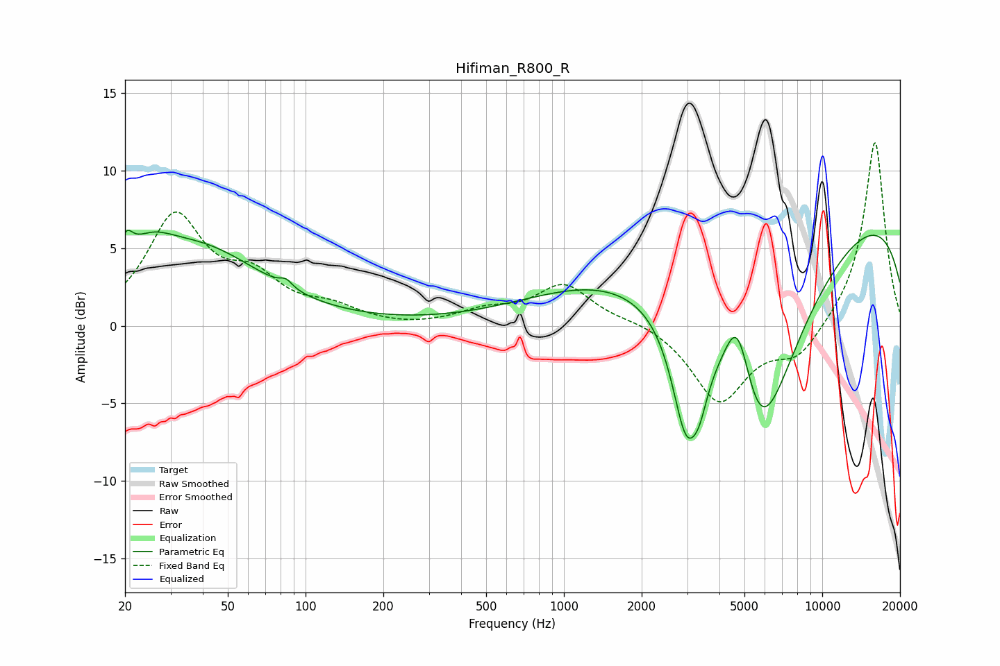

# Hifiman_R800_R
See [usage instructions](https://github.com/jaakkopasanen/AutoEq#usage) for more options and info.

### Parametric EQs
Apply preamp of -6.2 dB when using parametric equalizer.

|   # | Type    |   Fc (Hz) |    Q |   Gain (dB) |
|-----|---------|-----------|------|-------------|
|   1 | Peaking |        20 | 5.69 |         1.7 |
|   2 | Peaking |        24 | 1.43 |         2.4 |
|   3 | Peaking |        40 | 0.59 |         4.6 |
|   4 | Peaking |        84 | 5.93 |         0.5 |
|   5 | Peaking |      1282 | 0.47 |         1.9 |
|   6 | Peaking |      2977 | 2.53 |        -7.2 |
|   7 | Peaking |      3350 | 4.54 |        -1.6 |
|   8 | Peaking |      4712 | 2.49 |         5.9 |
|   9 | Peaking |      5636 | 0.81 |       -15.2 |
|  10 | Peaking |     10000 | 0.18 |         8.3 |

### Fixed Band EQs
When using fixed band (also called graphic) equalizer, apply preamp of **-11.9 dB** (if available) and set gains manually with these parameters.

|   # | Type    |   Fc (Hz) |    Q |   Gain (dB) |
|-----|---------|-----------|------|-------------|
|   1 | Peaking |        31 | 1.41 |         6.8 |
|   2 | Peaking |        62 | 1.41 |         2.5 |
|   3 | Peaking |       125 | 1.41 |         1   |
|   4 | Peaking |       250 | 1.41 |        -0.1 |
|   5 | Peaking |       500 | 1.41 |         0.8 |
|   6 | Peaking |      1000 | 1.41 |         2.6 |
|   7 | Peaking |      2000 | 1.41 |         0.3 |
|   8 | Peaking |      4000 | 1.41 |        -4.9 |
|   9 | Peaking |      8000 | 1.41 |        -2   |
|  10 | Peaking |     16000 | 1.41 |        12   |

### Graphs

