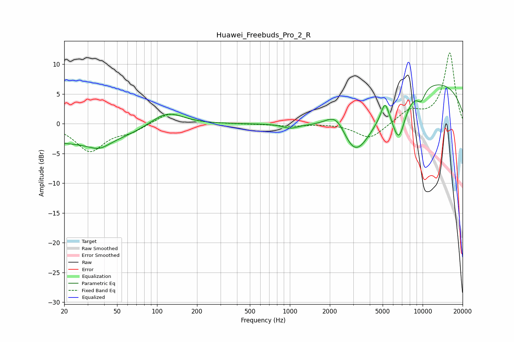

# Huawei_Freebuds_Pro_2_R
See [usage instructions](https://github.com/jaakkopasanen/AutoEq#usage) for more options and info.

### Parametric EQs
Apply preamp of -6.6 dB when using parametric equalizer.

|   # | Type    |   Fc (Hz) |    Q |   Gain (dB) |
|-----|---------|-----------|------|-------------|
|   1 | Peaking |        25 | 0.3  |        -3.2 |
|   2 | Peaking |        37 | 1.84 |        -1.3 |
|   3 | Peaking |       118 | 1.11 |         2.7 |
|   4 | Peaking |      1006 | 2.49 |        -0.7 |
|   5 | Peaking |      2271 | 1.58 |         4.8 |
|   6 | Peaking |      3055 | 0.95 |       -10.6 |
|   7 | Peaking |      5210 | 4.59 |         3.2 |
|   8 | Peaking |      6620 | 2.62 |        -6.8 |
|   9 | Peaking |      9730 | 3.93 |        -2   |
|  10 | Peaking |      9971 | 0.22 |         7.6 |

### Fixed Band EQs
When using fixed band (also called graphic) equalizer, apply preamp of **-12.0 dB** (if available) and set gains manually with these parameters.

|   # | Type    |   Fc (Hz) |    Q |   Gain (dB) |
|-----|---------|-----------|------|-------------|
|   1 | Peaking |        31 | 1.41 |        -4.5 |
|   2 | Peaking |        62 | 1.41 |        -1.2 |
|   3 | Peaking |       125 | 1.41 |         1.9 |
|   4 | Peaking |       250 | 1.41 |         0   |
|   5 | Peaking |       500 | 1.41 |        -0   |
|   6 | Peaking |      1000 | 1.41 |        -0.4 |
|   7 | Peaking |      2000 | 1.41 |         0.1 |
|   8 | Peaking |      4000 | 1.41 |        -2.6 |
|   9 | Peaking |      8000 | 1.41 |         2.1 |
|  10 | Peaking |     16000 | 1.41 |        11.9 |

### Graphs

