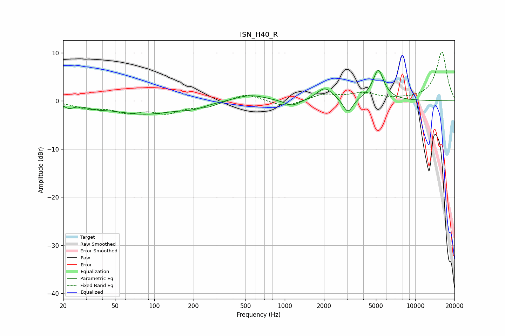

# ISN_H40_R
See [usage instructions](https://github.com/jaakkopasanen/AutoEq#usage) for more options and info.

### Parametric EQs
Apply preamp of -6.4 dB when using parametric equalizer.

|   # | Type    |   Fc (Hz) |    Q |   Gain (dB) |
|-----|---------|-----------|------|-------------|
|   1 | Peaking |        22 | 4.18 |        -0.9 |
|   2 | Peaking |        36 | 1.88 |        -0.6 |
|   3 | Peaking |        84 | 0.57 |        -2.7 |
|   4 | Peaking |       198 | 1.57 |        -0.8 |
|   5 | Peaking |       540 | 1.2  |         1.3 |
|   6 | Peaking |      1138 | 2.38 |        -1.3 |
|   7 | Peaking |      2028 | 2.37 |         2.7 |
|   8 | Peaking |      3052 | 3.79 |        -3.1 |
|   9 | Peaking |      5007 | 1.69 |         1.1 |
|  10 | Peaking |      5219 | 3.6  |         5.3 |

### Fixed Band EQs
When using fixed band (also called graphic) equalizer, apply preamp of **-10.2 dB** (if available) and set gains manually with these parameters.

|   # | Type    |   Fc (Hz) |    Q |   Gain (dB) |
|-----|---------|-----------|------|-------------|
|   1 | Peaking |        31 | 1.41 |        -1.3 |
|   2 | Peaking |        62 | 1.41 |        -2   |
|   3 | Peaking |       125 | 1.41 |        -2.2 |
|   4 | Peaking |       250 | 1.41 |        -1.2 |
|   5 | Peaking |       500 | 1.41 |         1.6 |
|   6 | Peaking |      1000 | 1.41 |        -1.4 |
|   7 | Peaking |      2000 | 1.41 |         1.3 |
|   8 | Peaking |      4000 | 1.41 |         1.4 |
|   9 | Peaking |      8000 | 1.41 |         0.2 |
|  10 | Peaking |     16000 | 1.41 |        10.2 |

### Graphs

