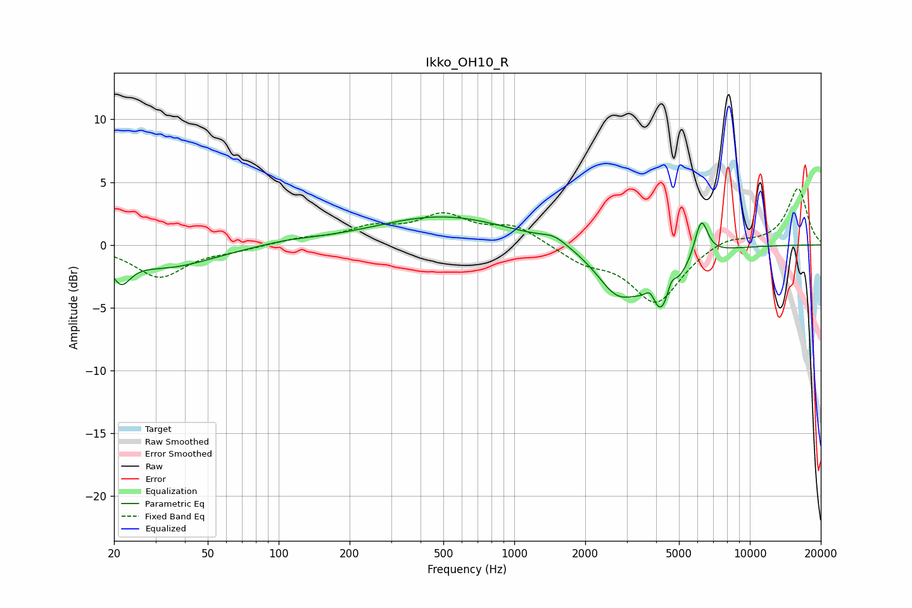

# Ikko_OH10_R
See [usage instructions](https://github.com/jaakkopasanen/AutoEq#usage) for more options and info.

### Parametric EQs
Apply preamp of -2.3 dB when using parametric equalizer.

|   # | Type    |   Fc (Hz) |    Q |   Gain (dB) |
|-----|---------|-----------|------|-------------|
|   1 | Peaking |        21 | 3.63 |        -2   |
|   2 | Peaking |        34 | 0.72 |        -1.7 |
|   3 | Peaking |       109 | 1.05 |         0.3 |
|   4 | Peaking |       498 | 0.49 |         2.3 |
|   5 | Peaking |      1477 | 2.62 |         0.6 |
|   6 | Peaking |      2735 | 1.56 |        -3.4 |
|   7 | Peaking |      3784 | 6    |         1.3 |
|   8 | Peaking |      4261 | 2.13 |        -5.4 |
|   9 | Peaking |      4631 | 6    |         1.9 |
|  10 | Peaking |      6216 | 4.88 |         3.1 |

### Fixed Band EQs
When using fixed band (also called graphic) equalizer, apply preamp of **-4.6 dB** (if available) and set gains manually with these parameters.

|   # | Type    |   Fc (Hz) |    Q |   Gain (dB) |
|-----|---------|-----------|------|-------------|
|   1 | Peaking |        31 | 1.41 |        -2.5 |
|   2 | Peaking |        62 | 1.41 |        -0.3 |
|   3 | Peaking |       125 | 1.41 |         0.4 |
|   4 | Peaking |       250 | 1.41 |         1.2 |
|   5 | Peaking |       500 | 1.41 |         2.1 |
|   6 | Peaking |      1000 | 1.41 |         1.4 |
|   7 | Peaking |      2000 | 1.41 |        -1.2 |
|   8 | Peaking |      4000 | 1.41 |        -4.6 |
|   9 | Peaking |      8000 | 1.41 |         0.7 |
|  10 | Peaking |     16000 | 1.41 |         4.5 |

### Graphs

