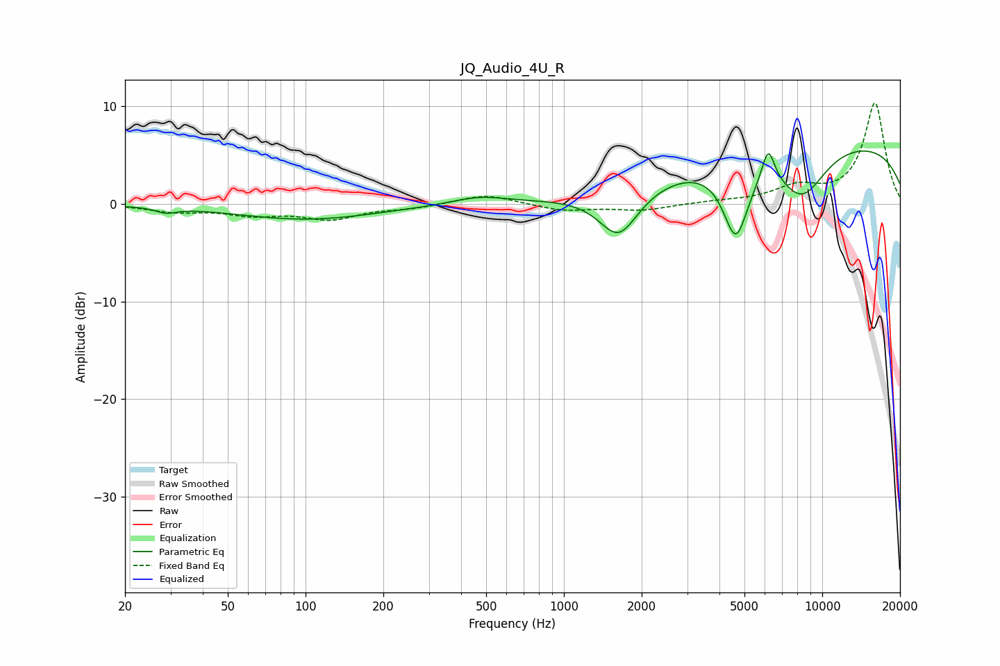

# JQ_Audio_4U_R
See [usage instructions](https://github.com/jaakkopasanen/AutoEq#usage) for more options and info.

### Parametric EQs
Apply preamp of -5.5 dB when using parametric equalizer.

|   # | Type    |   Fc (Hz) |    Q |   Gain (dB) |
|-----|---------|-----------|------|-------------|
|   1 | Peaking |        29 | 3.72 |        -0.5 |
|   2 | Peaking |       101 | 0.52 |        -1.6 |
|   3 | Peaking |       471 | 1.33 |         0.8 |
|   4 | Peaking |      1634 | 1.82 |        -5   |
|   5 | Peaking |      1869 | 3.46 |         0.1 |
|   6 | Peaking |      4629 | 2.8  |        -7.6 |
|   7 | Peaking |      6153 | 5.18 |         2   |
|   8 | Peaking |      6209 | 5.94 |         1.5 |
|   9 | Peaking |      8360 | 1.37 |        -5.1 |
|  10 | Peaking |     10000 | 0.19 |         6.5 |

### Fixed Band EQs
When using fixed band (also called graphic) equalizer, apply preamp of **-10.4 dB** (if available) and set gains manually with these parameters.

|   # | Type    |   Fc (Hz) |    Q |   Gain (dB) |
|-----|---------|-----------|------|-------------|
|   1 | Peaking |        31 | 1.41 |        -0.7 |
|   2 | Peaking |        62 | 1.41 |        -1   |
|   3 | Peaking |       125 | 1.41 |        -1.4 |
|   4 | Peaking |       250 | 1.41 |        -0.4 |
|   5 | Peaking |       500 | 1.41 |         1   |
|   6 | Peaking |      1000 | 1.41 |        -0.7 |
|   7 | Peaking |      2000 | 1.41 |        -0.6 |
|   8 | Peaking |      4000 | 1.41 |         0.2 |
|   9 | Peaking |      8000 | 1.41 |         1.6 |
|  10 | Peaking |     16000 | 1.41 |        10.3 |

### Graphs

