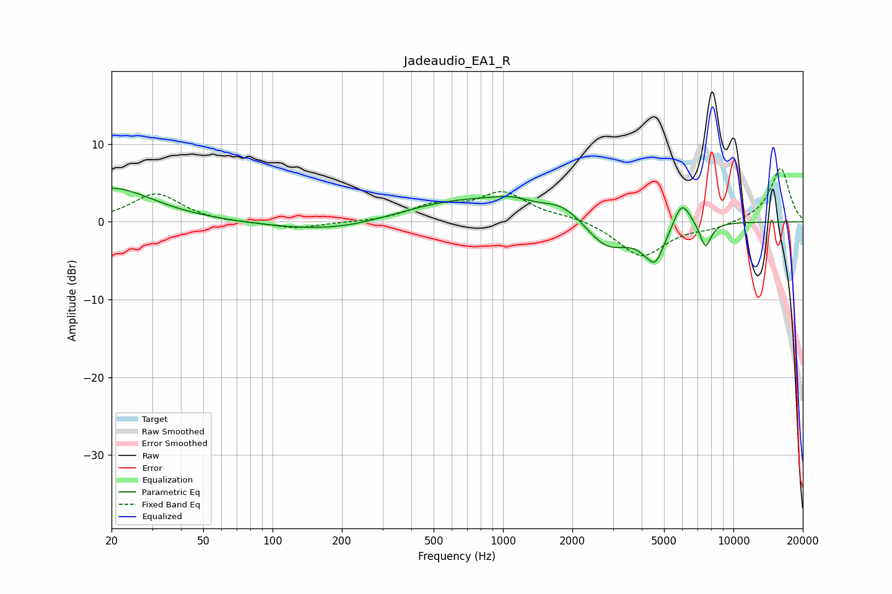

# Jadeaudio_EA1_R
See [usage instructions](https://github.com/jaakkopasanen/AutoEq#usage) for more options and info.

### Parametric EQs
Apply preamp of -4.4 dB when using parametric equalizer.

|   # | Type    |   Fc (Hz) |    Q |   Gain (dB) |
|-----|---------|-----------|------|-------------|
|   1 | Peaking |        20 | 0.79 |         4.4 |
|   2 | Peaking |       197 | 0.53 |        -1.6 |
|   3 | Peaking |       649 | 0.47 |         3.1 |
|   4 | Peaking |      1082 | 1.7  |         0.9 |
|   5 | Peaking |      1836 | 1.62 |         1.9 |
|   6 | Peaking |      2843 | 1.4  |        -3.9 |
|   7 | Peaking |      4341 | 5.99 |         0.7 |
|   8 | Peaking |      4503 | 3.06 |        -5.4 |
|   9 | Peaking |      5971 | 3.57 |         3.6 |
|  10 | Peaking |      7569 | 5.43 |        -3.3 |

### Fixed Band EQs
When using fixed band (also called graphic) equalizer, apply preamp of **-6.9 dB** (if available) and set gains manually with these parameters.

|   # | Type    |   Fc (Hz) |    Q |   Gain (dB) |
|-----|---------|-----------|------|-------------|
|   1 | Peaking |        31 | 1.41 |         3.6 |
|   2 | Peaking |        62 | 1.41 |        -0.2 |
|   3 | Peaking |       125 | 1.41 |        -0.9 |
|   4 | Peaking |       250 | 1.41 |        -0.1 |
|   5 | Peaking |       500 | 1.41 |         1.9 |
|   6 | Peaking |      1000 | 1.41 |         3.6 |
|   7 | Peaking |      2000 | 1.41 |         0.6 |
|   8 | Peaking |      4000 | 1.41 |        -4.5 |
|   9 | Peaking |      8000 | 1.41 |        -0.7 |
|  10 | Peaking |     16000 | 1.41 |         6.9 |

### Graphs

