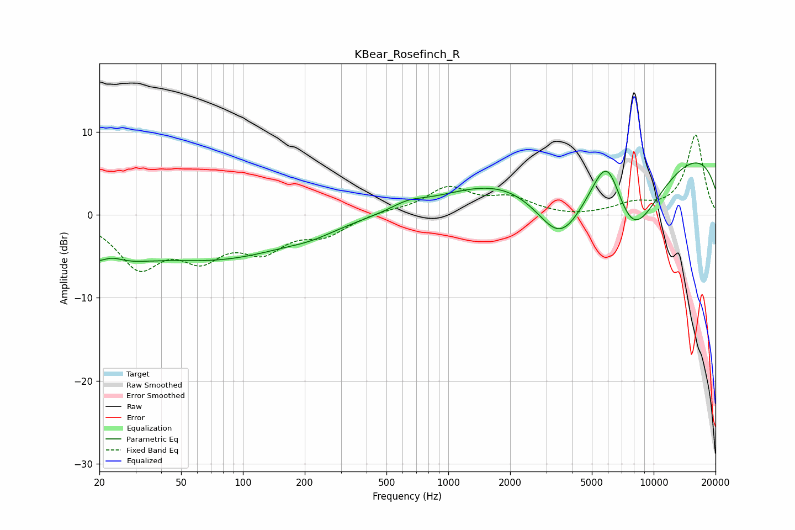

# KBear_Rosefinch_R
See [usage instructions](https://github.com/jaakkopasanen/AutoEq#usage) for more options and info.

### Parametric EQs
Apply preamp of -6.4 dB when using parametric equalizer.

|   # | Type    |   Fc (Hz) |    Q |   Gain (dB) |
|-----|---------|-----------|------|-------------|
|   1 | Peaking |        20 | 0.83 |        -4.9 |
|   2 | Peaking |        23 | 2.26 |         1.5 |
|   3 | Peaking |        78 | 0.38 |        -4.9 |
|   4 | Peaking |       217 | 1.31 |        -0.6 |
|   5 | Peaking |       633 | 1.77 |         0.8 |
|   6 | Peaking |      1645 | 0.5  |         2.2 |
|   7 | Peaking |      3502 | 1.07 |        -8.1 |
|   8 | Peaking |      5944 | 1.68 |         8.2 |
|   9 | Peaking |      7739 | 0.84 |       -12   |
|  10 | Peaking |     10000 | 0.18 |         9.3 |

### Fixed Band EQs
When using fixed band (also called graphic) equalizer, apply preamp of **-9.7 dB** (if available) and set gains manually with these parameters.

|   # | Type    |   Fc (Hz) |    Q |   Gain (dB) |
|-----|---------|-----------|------|-------------|
|   1 | Peaking |        31 | 1.41 |        -5.8 |
|   2 | Peaking |        62 | 1.41 |        -4.3 |
|   3 | Peaking |       125 | 1.41 |        -3.7 |
|   4 | Peaking |       250 | 1.41 |        -2.1 |
|   5 | Peaking |       500 | 1.41 |         0.4 |
|   6 | Peaking |      1000 | 1.41 |         3.1 |
|   7 | Peaking |      2000 | 1.41 |         1.8 |
|   8 | Peaking |      4000 | 1.41 |        -0.3 |
|   9 | Peaking |      8000 | 1.41 |         1.1 |
|  10 | Peaking |     16000 | 1.41 |         9.6 |

### Graphs

