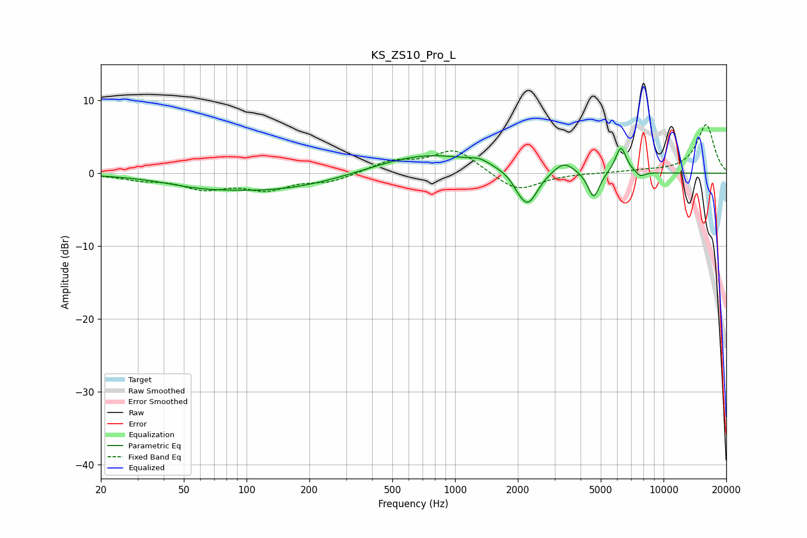

# KS_ZS10_Pro_L
See [usage instructions](https://github.com/jaakkopasanen/AutoEq#usage) for more options and info.

### Parametric EQs
Apply preamp of -3.5 dB when using parametric equalizer.

|   # | Type    |   Fc (Hz) |    Q |   Gain (dB) |
|-----|---------|-----------|------|-------------|
|   1 | Peaking |        57 | 0.97 |        -0.6 |
|   2 | Peaking |       131 | 0.41 |        -2.4 |
|   3 | Peaking |       726 | 0.55 |         2.8 |
|   4 | Peaking |      1310 | 3.12 |         0.6 |
|   5 | Peaking |      2006 | 4.64 |        -0.6 |
|   6 | Peaking |      2237 | 2.94 |        -4.7 |
|   7 | Peaking |      3329 | 2.87 |         1.6 |
|   8 | Peaking |      4624 | 4.99 |        -3.7 |
|   9 | Peaking |      6240 | 5.25 |         3.7 |
|  10 | Peaking |      7752 | 6    |        -0.7 |

### Fixed Band EQs
When using fixed band (also called graphic) equalizer, apply preamp of **-6.8 dB** (if available) and set gains manually with these parameters.

|   # | Type    |   Fc (Hz) |    Q |   Gain (dB) |
|-----|---------|-----------|------|-------------|
|   1 | Peaking |        31 | 1.41 |        -0.7 |
|   2 | Peaking |        62 | 1.41 |        -1.9 |
|   3 | Peaking |       125 | 1.41 |        -2   |
|   4 | Peaking |       250 | 1.41 |        -1.1 |
|   5 | Peaking |       500 | 1.41 |         1.6 |
|   6 | Peaking |      1000 | 1.41 |         3.3 |
|   7 | Peaking |      2000 | 1.41 |        -2.6 |
|   8 | Peaking |      4000 | 1.41 |         0   |
|   9 | Peaking |      8000 | 1.41 |         0.3 |
|  10 | Peaking |     16000 | 1.41 |         6.7 |

### Graphs

