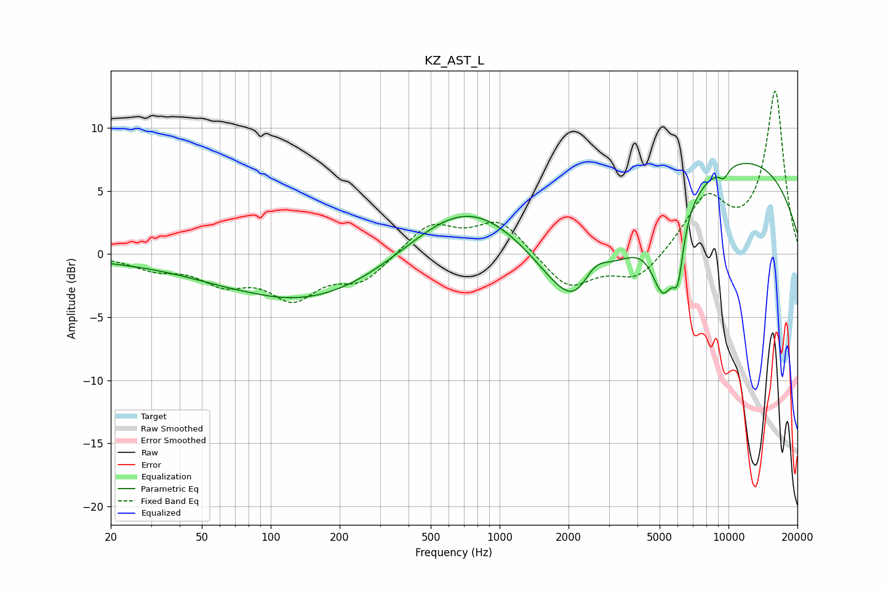

# KZ_AST_L
See [usage instructions](https://github.com/jaakkopasanen/AutoEq#usage) for more options and info.

### Parametric EQs
Apply preamp of -7.3 dB when using parametric equalizer.

|   # | Type    |   Fc (Hz) |    Q |   Gain (dB) |
|-----|---------|-----------|------|-------------|
|   1 | Peaking |        30 | 0.28 |        -0.3 |
|   2 | Peaking |        84 | 1.81 |         0.1 |
|   3 | Peaking |       267 | 0.25 |        -5.4 |
|   4 | Peaking |       711 | 0.44 |         8.5 |
|   5 | Peaking |      2356 | 0.74 |       -15.8 |
|   6 | Peaking |      2551 | 1.72 |         6   |
|   7 | Peaking |      5207 | 2.56 |        -6.3 |
|   8 | Peaking |      6013 | 6    |        -3.7 |
|   9 | Peaking |      7497 | 0.19 |         8.9 |
|  10 | Peaking |      9538 | 6    |        -0.8 |

### Fixed Band EQs
When using fixed band (also called graphic) equalizer, apply preamp of **-13.0 dB** (if available) and set gains manually with these parameters.

|   # | Type    |   Fc (Hz) |    Q |   Gain (dB) |
|-----|---------|-----------|------|-------------|
|   1 | Peaking |        31 | 1.41 |        -1   |
|   2 | Peaking |        62 | 1.41 |        -2   |
|   3 | Peaking |       125 | 1.41 |        -3.2 |
|   4 | Peaking |       250 | 1.41 |        -2   |
|   5 | Peaking |       500 | 1.41 |         2.4 |
|   6 | Peaking |      1000 | 1.41 |         2.6 |
|   7 | Peaking |      2000 | 1.41 |        -2.8 |
|   8 | Peaking |      4000 | 1.41 |        -2.1 |
|   9 | Peaking |      8000 | 1.41 |         4.3 |
|  10 | Peaking |     16000 | 1.41 |        12.8 |

### Graphs

