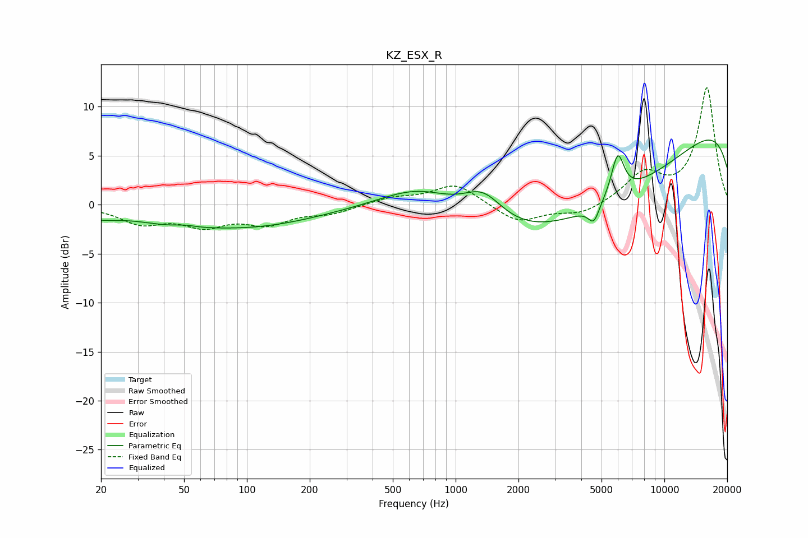

# KZ_ESX_R
See [usage instructions](https://github.com/jaakkopasanen/AutoEq#usage) for more options and info.

### Parametric EQs
Apply preamp of -6.7 dB when using parametric equalizer.

|   # | Type    |   Fc (Hz) |    Q |   Gain (dB) |
|-----|---------|-----------|------|-------------|
|   1 | Peaking |        28 | 1.32 |         0.4 |
|   2 | Peaking |        49 | 0.23 |        -2.2 |
|   3 | Peaking |        50 | 3.25 |         0.2 |
|   4 | Peaking |       125 | 0.56 |        -0.5 |
|   5 | Peaking |       684 | 0.72 |         3.4 |
|   6 | Peaking |      1352 | 1.42 |         3.3 |
|   7 | Peaking |      4299 | 0.22 |       -10.6 |
|   8 | Peaking |      4595 | 5.25 |        -1.8 |
|   9 | Peaking |      5977 | 4.46 |         4.3 |
|  10 | Peaking |     10000 | 0.18 |        11.9 |

### Fixed Band EQs
When using fixed band (also called graphic) equalizer, apply preamp of **-12.0 dB** (if available) and set gains manually with these parameters.

|   # | Type    |   Fc (Hz) |    Q |   Gain (dB) |
|-----|---------|-----------|------|-------------|
|   1 | Peaking |        31 | 1.41 |        -1.7 |
|   2 | Peaking |        62 | 1.41 |        -1.9 |
|   3 | Peaking |       125 | 1.41 |        -1.7 |
|   4 | Peaking |       250 | 1.41 |        -0.8 |
|   5 | Peaking |       500 | 1.41 |         0.7 |
|   6 | Peaking |      1000 | 1.41 |         2.1 |
|   7 | Peaking |      2000 | 1.41 |        -1.9 |
|   8 | Peaking |      4000 | 1.41 |        -1   |
|   9 | Peaking |      8000 | 1.41 |         3   |
|  10 | Peaking |     16000 | 1.41 |        11.9 |

### Graphs

