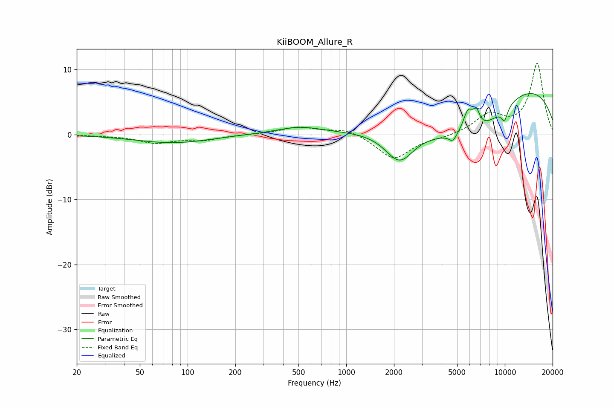

# KiiBOOM_Allure_R
See [usage instructions](https://github.com/jaakkopasanen/AutoEq#usage) for more options and info.

### Parametric EQs
Apply preamp of -6.4 dB when using parametric equalizer.

|   # | Type    |   Fc (Hz) |    Q |   Gain (dB) |
|-----|---------|-----------|------|-------------|
|   1 | Peaking |        81 | 0.6  |        -1.3 |
|   2 | Peaking |       503 | 1.03 |         1   |
|   3 | Peaking |      1571 | 0.18 |         0.3 |
|   4 | Peaking |      2166 | 1.58 |        -4.7 |
|   5 | Peaking |      4701 | 6    |        -1.1 |
|   6 | Peaking |      5853 | 4.36 |         3.5 |
|   7 | Peaking |      6615 | 0.45 |       -11.4 |
|   8 | Peaking |      6618 | 5.99 |         2.4 |
|   9 | Peaking |      9628 | 0.27 |        12.9 |
|  10 | Peaking |      9952 | 6    |        -2   |

### Fixed Band EQs
When using fixed band (also called graphic) equalizer, apply preamp of **-11.1 dB** (if available) and set gains manually with these parameters.

|   # | Type    |   Fc (Hz) |    Q |   Gain (dB) |
|-----|---------|-----------|------|-------------|
|   1 | Peaking |        31 | 1.41 |        -0.1 |
|   2 | Peaking |        62 | 1.41 |        -1.2 |
|   3 | Peaking |       125 | 1.41 |        -0.8 |
|   4 | Peaking |       250 | 1.41 |         0   |
|   5 | Peaking |       500 | 1.41 |         1.1 |
|   6 | Peaking |      1000 | 1.41 |         1   |
|   7 | Peaking |      2000 | 1.41 |        -3.8 |
|   8 | Peaking |      4000 | 1.41 |        -0.4 |
|   9 | Peaking |      8000 | 1.41 |         2.9 |
|  10 | Peaking |     16000 | 1.41 |        10.9 |

### Graphs

