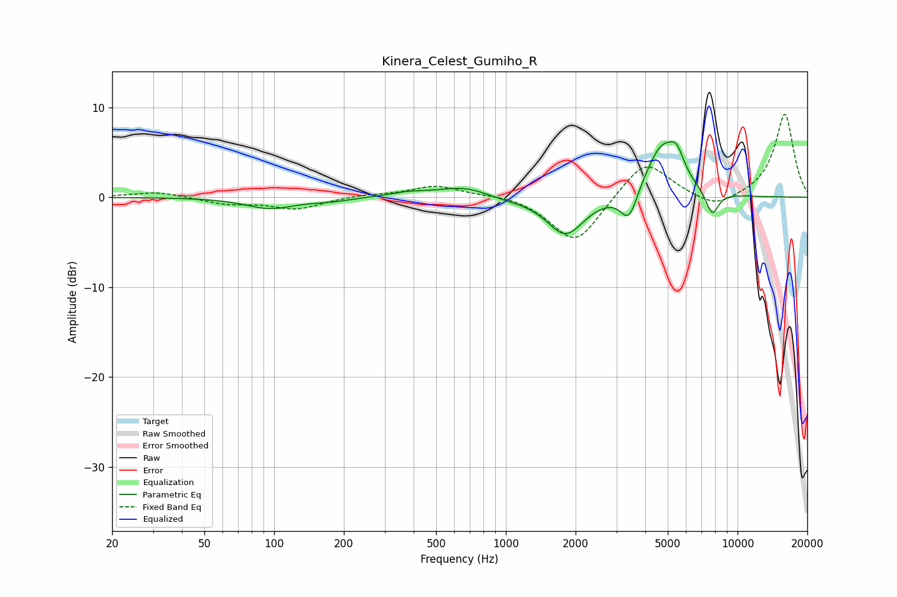

# Kinera_Celest_Gumiho_R
See [usage instructions](https://github.com/jaakkopasanen/AutoEq#usage) for more options and info.

### Parametric EQs
Apply preamp of -6.3 dB when using parametric equalizer.

|   # | Type    |   Fc (Hz) |    Q |   Gain (dB) |
|-----|---------|-----------|------|-------------|
|   1 | Peaking |        96 | 1.36 |        -1.2 |
|   2 | Peaking |       175 | 1.53 |        -0.3 |
|   3 | Peaking |       377 | 1.86 |         0.4 |
|   4 | Peaking |       678 | 1.13 |         1.4 |
|   5 | Peaking |       941 | 1.38 |        -0.5 |
|   6 | Peaking |      1811 | 1.76 |        -4.3 |
|   7 | Peaking |      3402 | 3.76 |        -3.5 |
|   8 | Peaking |      4738 | 1.88 |         5.9 |
|   9 | Peaking |      5475 | 4.57 |         2.1 |
|  10 | Peaking |      7770 | 4.75 |        -2.7 |

### Fixed Band EQs
When using fixed band (also called graphic) equalizer, apply preamp of **-9.3 dB** (if available) and set gains manually with these parameters.

|   # | Type    |   Fc (Hz) |    Q |   Gain (dB) |
|-----|---------|-----------|------|-------------|
|   1 | Peaking |        31 | 1.41 |         0.6 |
|   2 | Peaking |        62 | 1.41 |        -0.7 |
|   3 | Peaking |       125 | 1.41 |        -1.3 |
|   4 | Peaking |       250 | 1.41 |         0.3 |
|   5 | Peaking |       500 | 1.41 |         1.3 |
|   6 | Peaking |      1000 | 1.41 |         0.4 |
|   7 | Peaking |      2000 | 1.41 |        -5.3 |
|   8 | Peaking |      4000 | 1.41 |         4.4 |
|   9 | Peaking |      8000 | 1.41 |        -1.4 |
|  10 | Peaking |     16000 | 1.41 |         9.3 |

### Graphs

