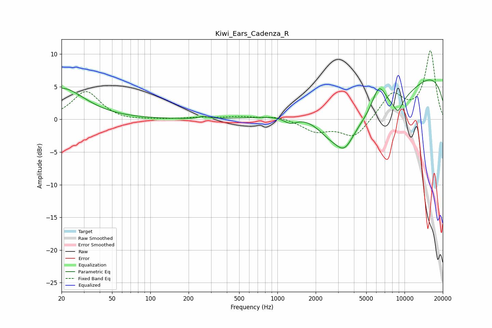

# Kiwi_Ears_Cadenza_R
See [usage instructions](https://github.com/jaakkopasanen/AutoEq#usage) for more options and info.

### Parametric EQs
Apply preamp of -6.1 dB when using parametric equalizer.

|   # | Type    |   Fc (Hz) |    Q |   Gain (dB) |
|-----|---------|-----------|------|-------------|
|   1 | Peaking |        20 | 0.8  |         4.8 |
|   2 | Peaking |       261 | 4.42 |         0.4 |
|   3 | Peaking |      1260 | 2.74 |        -1   |
|   4 | Peaking |      1326 | 2.68 |        -0.1 |
|   5 | Peaking |      2530 | 1.34 |        -2.6 |
|   6 | Peaking |      3367 | 1.87 |        -4   |
|   7 | Peaking |      5981 | 0.42 |        -8.6 |
|   8 | Peaking |      6300 | 2.2  |         4.9 |
|   9 | Peaking |      8899 | 3.8  |        -1.9 |
|  10 | Peaking |      9431 | 0.18 |         9.6 |

### Fixed Band EQs
When using fixed band (also called graphic) equalizer, apply preamp of **-10.6 dB** (if available) and set gains manually with these parameters.

|   # | Type    |   Fc (Hz) |    Q |   Gain (dB) |
|-----|---------|-----------|------|-------------|
|   1 | Peaking |        31 | 1.41 |         4.3 |
|   2 | Peaking |        62 | 1.41 |        -0.3 |
|   3 | Peaking |       125 | 1.41 |        -0   |
|   4 | Peaking |       250 | 1.41 |         0.3 |
|   5 | Peaking |       500 | 1.41 |         0.4 |
|   6 | Peaking |      1000 | 1.41 |         0.5 |
|   7 | Peaking |      2000 | 1.41 |        -1.8 |
|   8 | Peaking |      4000 | 1.41 |        -2.8 |
|   9 | Peaking |      8000 | 1.41 |         3.9 |
|  10 | Peaking |     16000 | 1.41 |        10.4 |

### Graphs

