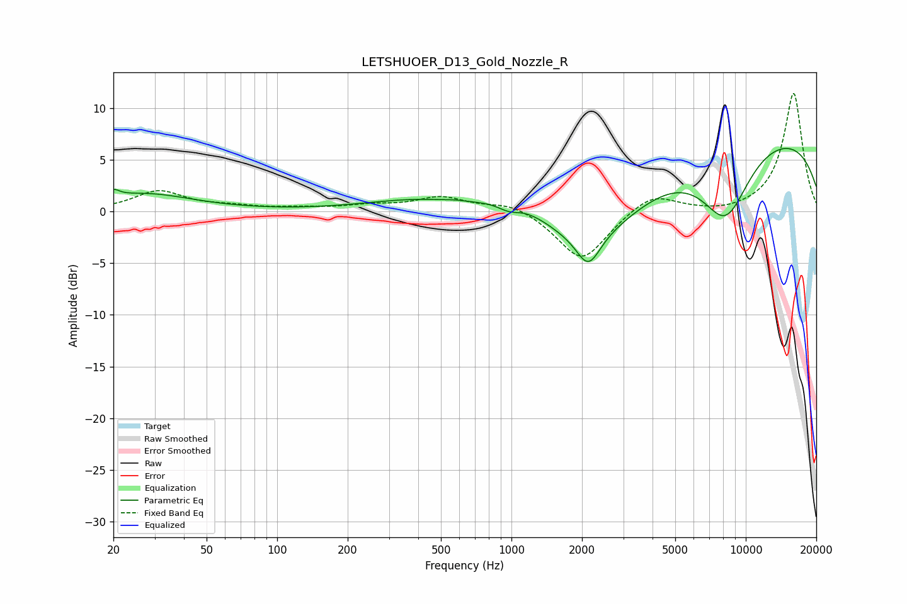

# LETSHUOER_D13_Gold_Nozzle_R
See [usage instructions](https://github.com/jaakkopasanen/AutoEq#usage) for more options and info.

### Parametric EQs
Apply preamp of -6.2 dB when using parametric equalizer.

|   # | Type    |   Fc (Hz) |    Q |   Gain (dB) |
|-----|---------|-----------|------|-------------|
|   1 | Peaking |        20 | 5.78 |         0.7 |
|   2 | Peaking |        27 | 0.68 |         1.7 |
|   3 | Peaking |       417 | 0.59 |         1.2 |
|   4 | Peaking |       575 | 3.28 |         0.1 |
|   5 | Peaking |       977 | 2.88 |        -0.8 |
|   6 | Peaking |      1063 | 0.94 |         2.2 |
|   7 | Peaking |      2129 | 2.83 |        -3.1 |
|   8 | Peaking |      2220 | 0.54 |        -6.4 |
|   9 | Peaking |      8206 | 1.22 |        -7.1 |
|  10 | Peaking |      9528 | 0.19 |         8   |

### Fixed Band EQs
When using fixed band (also called graphic) equalizer, apply preamp of **-11.5 dB** (if available) and set gains manually with these parameters.

|   # | Type    |   Fc (Hz) |    Q |   Gain (dB) |
|-----|---------|-----------|------|-------------|
|   1 | Peaking |        31 | 1.41 |         1.9 |
|   2 | Peaking |        62 | 1.41 |         0.4 |
|   3 | Peaking |       125 | 1.41 |         0.3 |
|   4 | Peaking |       250 | 1.41 |         0.5 |
|   5 | Peaking |       500 | 1.41 |         1.3 |
|   6 | Peaking |      1000 | 1.41 |         0.9 |
|   7 | Peaking |      2000 | 1.41 |        -4.9 |
|   8 | Peaking |      4000 | 1.41 |         1.9 |
|   9 | Peaking |      8000 | 1.41 |        -0.3 |
|  10 | Peaking |     16000 | 1.41 |        11.5 |

### Graphs

