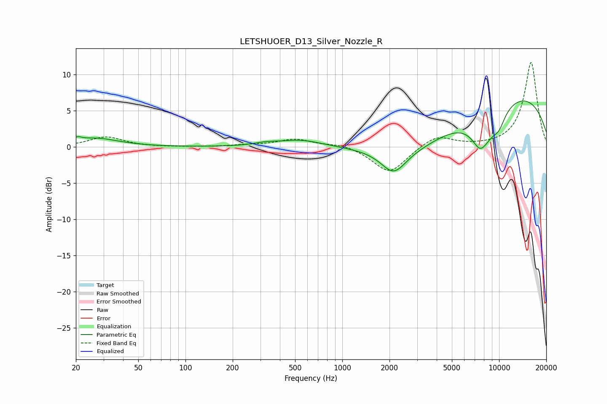

# LETSHUOER_D13_Silver_Nozzle_R
See [usage instructions](https://github.com/jaakkopasanen/AutoEq#usage) for more options and info.

### Parametric EQs
Apply preamp of -6.5 dB when using parametric equalizer.

|   # | Type    |   Fc (Hz) |    Q |   Gain (dB) |
|-----|---------|-----------|------|-------------|
|   1 | Peaking |        20 | 5.86 |         0.5 |
|   2 | Peaking |        26 | 0.96 |         1.2 |
|   3 | Peaking |       324 | 1.92 |         0.3 |
|   4 | Peaking |       543 | 1.02 |         1   |
|   5 | Peaking |      2126 | 1.8  |        -3.2 |
|   6 | Peaking |      3049 | 0.47 |        -5.6 |
|   7 | Peaking |      7537 | 2.8  |        -2.1 |
|   8 | Peaking |      8243 | 1.24 |        -4.1 |
|   9 | Peaking |      8651 | 0.19 |         8.6 |
|  10 | Peaking |     10000 | 3.17 |        -1.5 |

### Fixed Band EQs
When using fixed band (also called graphic) equalizer, apply preamp of **-11.8 dB** (if available) and set gains manually with these parameters.

|   # | Type    |   Fc (Hz) |    Q |   Gain (dB) |
|-----|---------|-----------|------|-------------|
|   1 | Peaking |        31 | 1.41 |         1.4 |
|   2 | Peaking |        62 | 1.41 |        -0   |
|   3 | Peaking |       125 | 1.41 |        -0   |
|   4 | Peaking |       250 | 1.41 |         0.2 |
|   5 | Peaking |       500 | 1.41 |         1.1 |
|   6 | Peaking |      1000 | 1.41 |         0.5 |
|   7 | Peaking |      2000 | 1.41 |        -3.7 |
|   8 | Peaking |      4000 | 1.41 |         1.7 |
|   9 | Peaking |      8000 | 1.41 |         0   |
|  10 | Peaking |     16000 | 1.41 |        11.8 |

### Graphs

