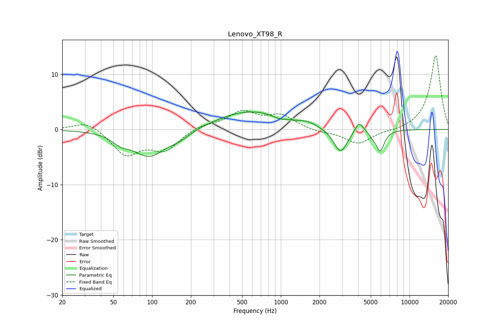

# Lenovo_XT98_R
See [usage instructions](https://github.com/jaakkopasanen/AutoEq#usage) for more options and info.

### Parametric EQs
Apply preamp of -3.3 dB when using parametric equalizer.

|   # | Type    |   Fc (Hz) |    Q |   Gain (dB) |
|-----|---------|-----------|------|-------------|
|   1 | Peaking |        57 | 2.17 |        -1.3 |
|   2 | Peaking |        94 | 1.12 |        -4.7 |
|   3 | Peaking |       162 | 1.55 |        -1.3 |
|   4 | Peaking |       584 | 0.53 |         3.4 |
|   5 | Peaking |       975 | 2.64 |        -0.5 |
|   6 | Peaking |      1625 | 2.35 |         0.6 |
|   7 | Peaking |      2911 | 2.66 |        -4.4 |
|   8 | Peaking |      4063 | 4.37 |         2   |
|   9 | Peaking |      5178 | 5.89 |        -0.6 |
|  10 | Peaking |      5923 | 4.26 |        -3.8 |

### Fixed Band EQs
When using fixed band (also called graphic) equalizer, apply preamp of **-13.5 dB** (if available) and set gains manually with these parameters.

|   # | Type    |   Fc (Hz) |    Q |   Gain (dB) |
|-----|---------|-----------|------|-------------|
|   1 | Peaking |        31 | 1.41 |         1.7 |
|   2 | Peaking |        62 | 1.41 |        -4.5 |
|   3 | Peaking |       125 | 1.41 |        -3.5 |
|   4 | Peaking |       250 | 1.41 |         0.9 |
|   5 | Peaking |       500 | 1.41 |         3   |
|   6 | Peaking |      1000 | 1.41 |         2.4 |
|   7 | Peaking |      2000 | 1.41 |        -0.5 |
|   8 | Peaking |      4000 | 1.41 |        -2.6 |
|   9 | Peaking |      8000 | 1.41 |        -0.3 |
|  10 | Peaking |     16000 | 1.41 |        13.5 |

### Graphs

