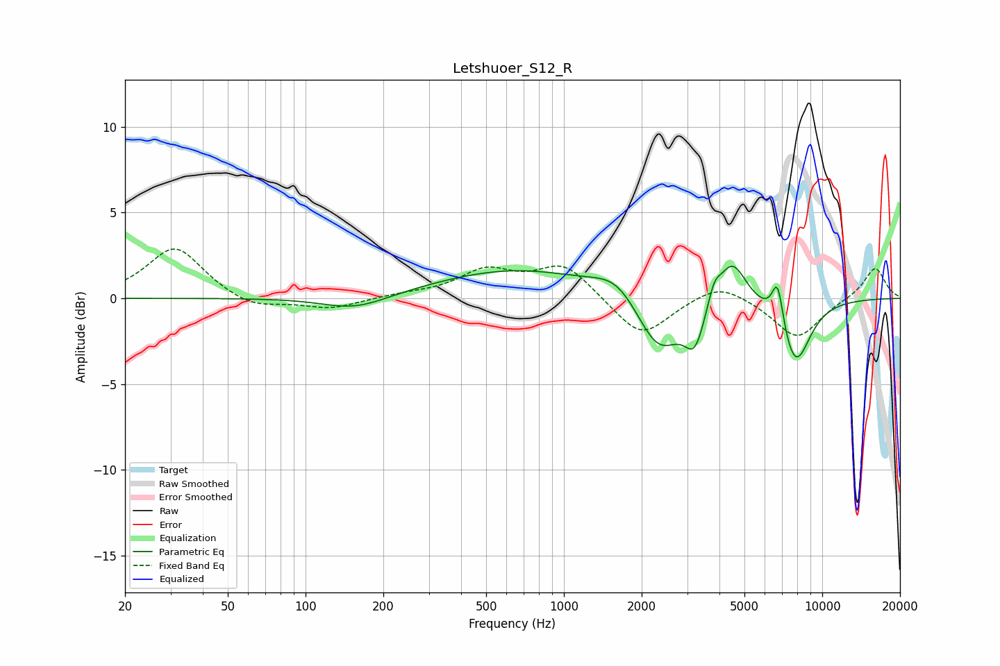

# Letshuoer_S12_R
See [usage instructions](https://github.com/jaakkopasanen/AutoEq#usage) for more options and info.

### Parametric EQs
Apply preamp of -2.0 dB when using parametric equalizer.

|   # | Type    |   Fc (Hz) |    Q |   Gain (dB) |
|-----|---------|-----------|------|-------------|
|   1 | Peaking |       149 | 1.17 |        -0.6 |
|   2 | Peaking |       178 | 1.21 |        -0.2 |
|   3 | Peaking |       652 | 0.46 |         1.7 |
|   4 | Peaking |      1597 | 1.63 |         1.1 |
|   5 | Peaking |      2330 | 1.63 |        -3.4 |
|   6 | Peaking |      3211 | 3.6  |        -2.4 |
|   7 | Peaking |      3814 | 6    |         1.1 |
|   8 | Peaking |      4477 | 2.58 |         2.6 |
|   9 | Peaking |      6720 | 6    |         2.6 |
|  10 | Peaking |      7856 | 2.23 |        -3.9 |

### Fixed Band EQs
When using fixed band (also called graphic) equalizer, apply preamp of **-3.0 dB** (if available) and set gains manually with these parameters.

|   # | Type    |   Fc (Hz) |    Q |   Gain (dB) |
|-----|---------|-----------|------|-------------|
|   1 | Peaking |        31 | 1.41 |         3   |
|   2 | Peaking |        62 | 1.41 |        -0.7 |
|   3 | Peaking |       125 | 1.41 |        -0.6 |
|   4 | Peaking |       250 | 1.41 |         0.2 |
|   5 | Peaking |       500 | 1.41 |         1.5 |
|   6 | Peaking |      1000 | 1.41 |         2   |
|   7 | Peaking |      2000 | 1.41 |        -2.4 |
|   8 | Peaking |      4000 | 1.41 |         1   |
|   9 | Peaking |      8000 | 1.41 |        -2.3 |
|  10 | Peaking |     16000 | 1.41 |         1.8 |

### Graphs

