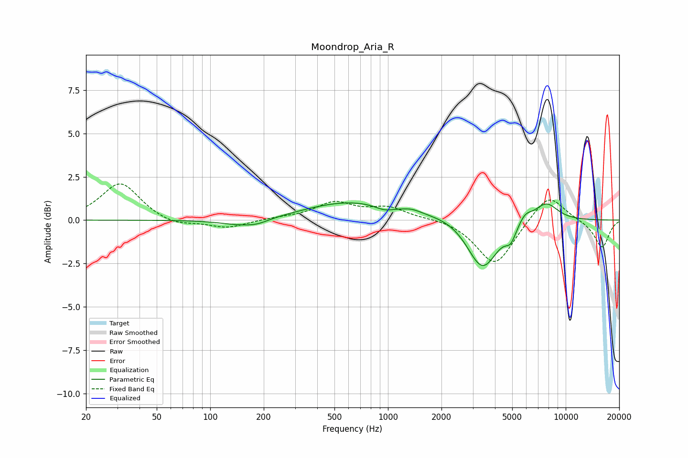

# Moondrop_Aria_R
See [usage instructions](https://github.com/jaakkopasanen/AutoEq#usage) for more options and info.

### Parametric EQs
Apply preamp of -1.1 dB when using parametric equalizer.

|   # | Type    |   Fc (Hz) |    Q |   Gain (dB) |
|-----|---------|-----------|------|-------------|
|   1 | Peaking |       152 | 1.15 |        -0.4 |
|   2 | Peaking |       185 | 2.27 |        -0.2 |
|   3 | Peaking |       615 | 0.56 |         1   |
|   4 | Peaking |       952 | 2.84 |        -0.2 |
|   5 | Peaking |      1358 | 2.46 |         0.2 |
|   6 | Peaking |      2222 | 1.04 |         0.3 |
|   7 | Peaking |      3401 | 1.66 |        -2.9 |
|   8 | Peaking |      4905 | 4.72 |        -0.7 |
|   9 | Peaking |      5912 | 3.73 |         0.5 |
|  10 | Peaking |      7756 | 1.95 |         1.1 |

### Fixed Band EQs
When using fixed band (also called graphic) equalizer, apply preamp of **-2.2 dB** (if available) and set gains manually with these parameters.

|   # | Type    |   Fc (Hz) |    Q |   Gain (dB) |
|-----|---------|-----------|------|-------------|
|   1 | Peaking |        31 | 1.41 |         2.2 |
|   2 | Peaking |        62 | 1.41 |        -0.4 |
|   3 | Peaking |       125 | 1.41 |        -0.5 |
|   4 | Peaking |       250 | 1.41 |         0.1 |
|   5 | Peaking |       500 | 1.41 |         1   |
|   6 | Peaking |      1000 | 1.41 |         0.7 |
|   7 | Peaking |      2000 | 1.41 |         0.1 |
|   8 | Peaking |      4000 | 1.41 |        -2.6 |
|   9 | Peaking |      8000 | 1.41 |         1.6 |
|  10 | Peaking |     16000 | 1.41 |        -1.6 |

### Graphs

