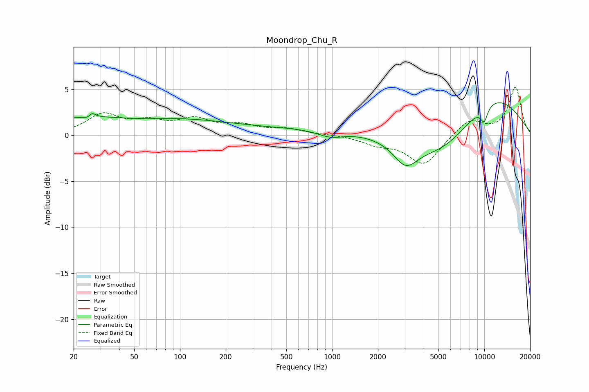

# Moondrop_Chu_R
See [usage instructions](https://github.com/jaakkopasanen/AutoEq#usage) for more options and info.

### Parametric EQs
Apply preamp of -3.6 dB when using parametric equalizer.

|   # | Type    |   Fc (Hz) |    Q |   Gain (dB) |
|-----|---------|-----------|------|-------------|
|   1 | Peaking |        26 | 5.76 |        -1.8 |
|   2 | Peaking |        26 | 5.95 |         2.1 |
|   3 | Peaking |        42 | 0.18 |         2.1 |
|   4 | Peaking |        56 | 0.89 |        -0.3 |
|   5 | Peaking |       975 | 1.63 |        -0.8 |
|   6 | Peaking |      1965 | 0.18 |         0.9 |
|   7 | Peaking |      3038 | 1.82 |        -2.5 |
|   8 | Peaking |      5714 | 0.54 |        -6   |
|   9 | Peaking |      9544 | 0.43 |         6.4 |
|  10 | Peaking |      9975 | 5.08 |        -1.6 |

### Fixed Band EQs
When using fixed band (also called graphic) equalizer, apply preamp of **-5.3 dB** (if available) and set gains manually with these parameters.

|   # | Type    |   Fc (Hz) |    Q |   Gain (dB) |
|-----|---------|-----------|------|-------------|
|   1 | Peaking |        31 | 1.41 |         2.2 |
|   2 | Peaking |        62 | 1.41 |         1.2 |
|   3 | Peaking |       125 | 1.41 |         1.5 |
|   4 | Peaking |       250 | 1.41 |         0.9 |
|   5 | Peaking |       500 | 1.41 |         0.6 |
|   6 | Peaking |      1000 | 1.41 |         0.1 |
|   7 | Peaking |      2000 | 1.41 |        -0.8 |
|   8 | Peaking |      4000 | 1.41 |        -3.2 |
|   9 | Peaking |      8000 | 1.41 |         1.7 |
|  10 | Peaking |     16000 | 1.41 |         5.2 |

### Graphs

