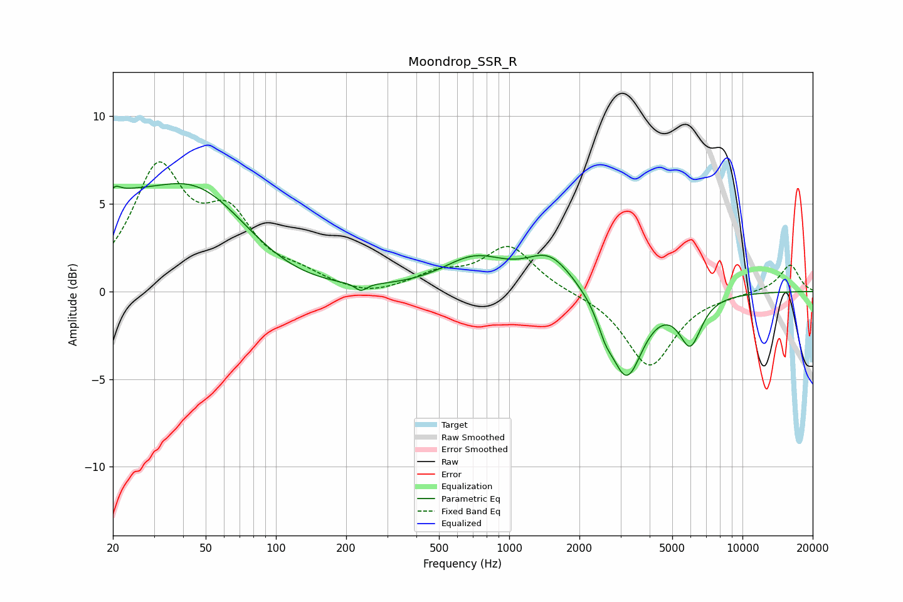

# Moondrop_SSR_R
See [usage instructions](https://github.com/jaakkopasanen/AutoEq#usage) for more options and info.

### Parametric EQs
Apply preamp of -6.3 dB when using parametric equalizer.

|   # | Type    |   Fc (Hz) |    Q |   Gain (dB) |
|-----|---------|-----------|------|-------------|
|   1 | Peaking |        20 | 5.59 |         0.7 |
|   2 | Peaking |        21 | 1.02 |         2.5 |
|   3 | Peaking |        46 | 0.56 |         5.9 |
|   4 | Peaking |       100 | 0.56 |        -1   |
|   5 | Peaking |       231 | 5.88 |        -0.4 |
|   6 | Peaking |       710 | 1.03 |         1.8 |
|   7 | Peaking |      1495 | 1.39 |         1.9 |
|   8 | Peaking |      2577 | 4.38 |        -0.9 |
|   9 | Peaking |      3184 | 2.04 |        -4.8 |
|  10 | Peaking |      5974 | 2.9  |        -2.7 |

### Fixed Band EQs
When using fixed band (also called graphic) equalizer, apply preamp of **-7.5 dB** (if available) and set gains manually with these parameters.

|   # | Type    |   Fc (Hz) |    Q |   Gain (dB) |
|-----|---------|-----------|------|-------------|
|   1 | Peaking |        31 | 1.41 |         6.7 |
|   2 | Peaking |        62 | 1.41 |         3.7 |
|   3 | Peaking |       125 | 1.41 |         0.7 |
|   4 | Peaking |       250 | 1.41 |        -0.4 |
|   5 | Peaking |       500 | 1.41 |         0.9 |
|   6 | Peaking |      1000 | 1.41 |         2.5 |
|   7 | Peaking |      2000 | 1.41 |        -0.1 |
|   8 | Peaking |      4000 | 1.41 |        -4.3 |
|   9 | Peaking |      8000 | 1.41 |        -0.1 |
|  10 | Peaking |     16000 | 1.41 |         1.5 |

### Graphs

