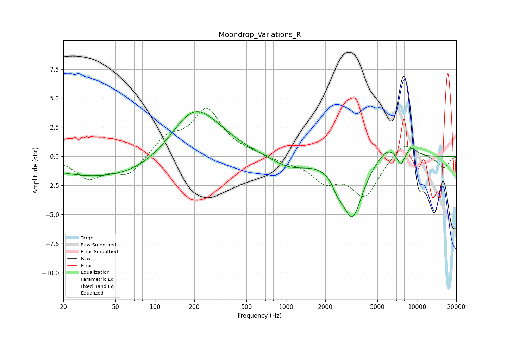

# Moondrop_Variations_R
See [usage instructions](https://github.com/jaakkopasanen/AutoEq#usage) for more options and info.

### Parametric EQs
Apply preamp of -3.9 dB when using parametric equalizer.

|   # | Type    |   Fc (Hz) |    Q |   Gain (dB) |
|-----|---------|-----------|------|-------------|
|   1 | Peaking |        25 | 0.45 |        -1.2 |
|   2 | Peaking |        69 | 0.53 |        -1.1 |
|   3 | Peaking |       197 | 0.84 |         3.8 |
|   4 | Peaking |       300 | 0.73 |         0.7 |
|   5 | Peaking |      1071 | 1.02 |        -1   |
|   6 | Peaking |      2475 | 3.81 |        -0.9 |
|   7 | Peaking |      3211 | 1.84 |        -5.1 |
|   8 | Peaking |      5954 | 1.81 |         1.1 |
|   9 | Peaking |      7548 | 4.87 |        -1.1 |
|  10 | Peaking |      9060 | 2.99 |         0.8 |

### Fixed Band EQs
When using fixed band (also called graphic) equalizer, apply preamp of **-4.2 dB** (if available) and set gains manually with these parameters.

|   # | Type    |   Fc (Hz) |    Q |   Gain (dB) |
|-----|---------|-----------|------|-------------|
|   1 | Peaking |        31 | 1.41 |        -1.8 |
|   2 | Peaking |        62 | 1.41 |        -1.6 |
|   3 | Peaking |       125 | 1.41 |         1.6 |
|   4 | Peaking |       250 | 1.41 |         3.9 |
|   5 | Peaking |       500 | 1.41 |         0.3 |
|   6 | Peaking |      1000 | 1.41 |        -0.4 |
|   7 | Peaking |      2000 | 1.41 |        -1.9 |
|   8 | Peaking |      4000 | 1.41 |        -3.3 |
|   9 | Peaking |      8000 | 1.41 |         1.4 |
|  10 | Peaking |     16000 | 1.41 |        -1   |

### Graphs

