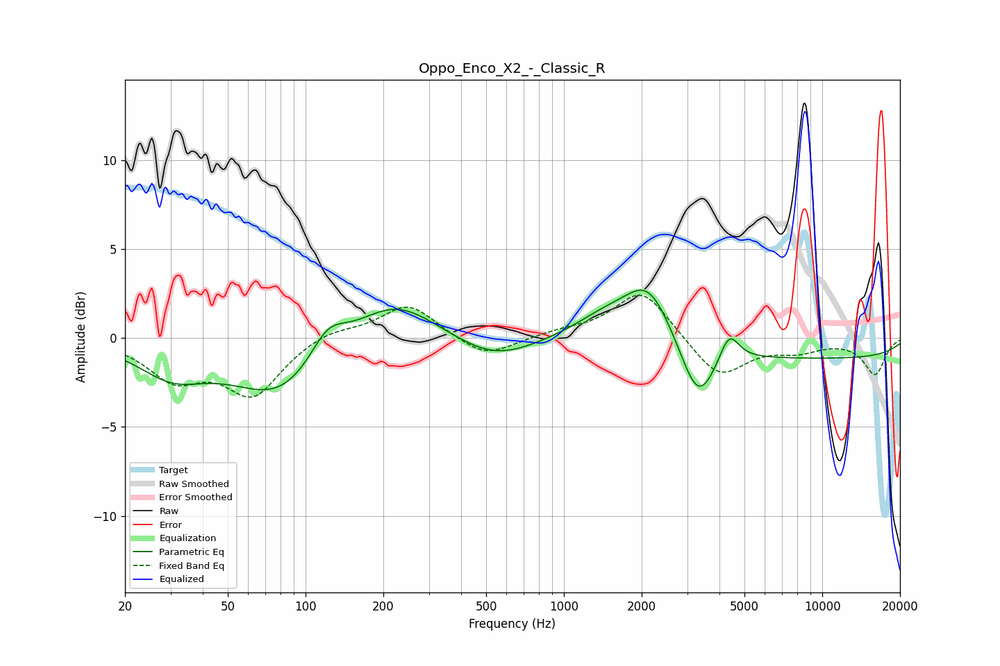

# Oppo_Enco_X2_-_Classic_R
See [usage instructions](https://github.com/jaakkopasanen/AutoEq#usage) for more options and info.

### Parametric EQs
Apply preamp of -2.8 dB when using parametric equalizer.

|   # | Type    |   Fc (Hz) |    Q |   Gain (dB) |
|-----|---------|-----------|------|-------------|
|   1 | Peaking |        30 | 1.09 |        -1.8 |
|   2 | Peaking |        81 | 0.75 |        -3.4 |
|   3 | Peaking |       122 | 1.96 |         1.9 |
|   4 | Peaking |       219 | 0.87 |         2.5 |
|   5 | Peaking |       536 | 0.9  |        -1.3 |
|   6 | Peaking |      1450 | 1.1  |         1.3 |
|   7 | Peaking |      2130 | 1.52 |         3.2 |
|   8 | Peaking |      3308 | 2.12 |        -3.3 |
|   9 | Peaking |      4361 | 3.73 |         1.7 |
|  10 | Peaking |      9069 | 0.18 |        -1.1 |

### Fixed Band EQs
When using fixed band (also called graphic) equalizer, apply preamp of **-2.5 dB** (if available) and set gains manually with these parameters.

|   # | Type    |   Fc (Hz) |    Q |   Gain (dB) |
|-----|---------|-----------|------|-------------|
|   1 | Peaking |        31 | 1.41 |        -2.1 |
|   2 | Peaking |        62 | 1.41 |        -3.1 |
|   3 | Peaking |       125 | 1.41 |         0.5 |
|   4 | Peaking |       250 | 1.41 |         1.9 |
|   5 | Peaking |       500 | 1.41 |        -1.2 |
|   6 | Peaking |      1000 | 1.41 |         0.3 |
|   7 | Peaking |      2000 | 1.41 |         2.8 |
|   8 | Peaking |      4000 | 1.41 |        -2.3 |
|   9 | Peaking |      8000 | 1.41 |        -0.6 |
|  10 | Peaking |     16000 | 1.41 |        -2   |

### Graphs

