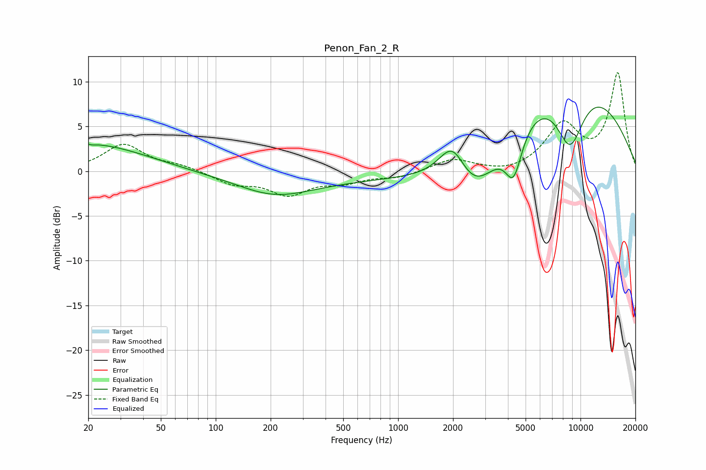

# Penon_Fan_2_R
See [usage instructions](https://github.com/jaakkopasanen/AutoEq#usage) for more options and info.

### Parametric EQs
Apply preamp of -7.2 dB when using parametric equalizer.

|   # | Type    |   Fc (Hz) |    Q |   Gain (dB) |
|-----|---------|-----------|------|-------------|
|   1 | Peaking |        20 | 4.7  |         2.9 |
|   2 | Peaking |        20 | 4.87 |        -2.8 |
|   3 | Peaking |        20 | 0.46 |         3   |
|   4 | Peaking |       210 | 0.71 |        -1.9 |
|   5 | Peaking |       592 | 0.18 |        -1   |
|   6 | Peaking |      1992 | 1.82 |         4.8 |
|   7 | Peaking |      2585 | 0.96 |        -6.5 |
|   8 | Peaking |      4298 | 3.01 |        -5.1 |
|   9 | Peaking |      8346 | 0.36 |        12   |
|  10 | Peaking |      8755 | 1.5  |        -8.2 |

### Fixed Band EQs
When using fixed band (also called graphic) equalizer, apply preamp of **-11.1 dB** (if available) and set gains manually with these parameters.

|   # | Type    |   Fc (Hz) |    Q |   Gain (dB) |
|-----|---------|-----------|------|-------------|
|   1 | Peaking |        31 | 1.41 |         3   |
|   2 | Peaking |        62 | 1.41 |         0.6 |
|   3 | Peaking |       125 | 1.41 |        -1.3 |
|   4 | Peaking |       250 | 1.41 |        -2.4 |
|   5 | Peaking |       500 | 1.41 |        -1.1 |
|   6 | Peaking |      1000 | 1.41 |        -0.7 |
|   7 | Peaking |      2000 | 1.41 |         1.4 |
|   8 | Peaking |      4000 | 1.41 |        -0.4 |
|   9 | Peaking |      8000 | 1.41 |         5   |
|  10 | Peaking |     16000 | 1.41 |        10.8 |

### Graphs

