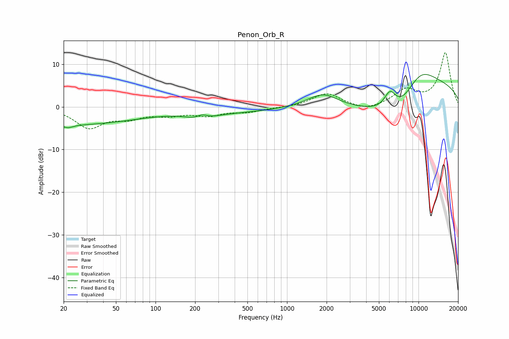

# Penon_Orb_R
See [usage instructions](https://github.com/jaakkopasanen/AutoEq#usage) for more options and info.

### Parametric EQs
Apply preamp of -7.7 dB when using parametric equalizer.

|   # | Type    |   Fc (Hz) |    Q |   Gain (dB) |
|-----|---------|-----------|------|-------------|
|   1 | Peaking |        20 | 0.22 |        -2.6 |
|   2 | Peaking |        21 | 0.26 |        -1.5 |
|   3 | Peaking |        22 | 3.99 |        -0.7 |
|   4 | Peaking |       221 | 1.56 |        -1.8 |
|   5 | Peaking |       226 | 3.29 |         1.4 |
|   6 | Peaking |       379 | 0.45 |        -1.1 |
|   7 | Peaking |      1874 | 1.18 |         3.4 |
|   8 | Peaking |      6075 | 3.04 |         4.2 |
|   9 | Peaking |      7399 | 0.45 |       -15.9 |
|  10 | Peaking |      9891 | 0.42 |        20   |

### Fixed Band EQs
When using fixed band (also called graphic) equalizer, apply preamp of **-12.8 dB** (if available) and set gains manually with these parameters.

|   # | Type    |   Fc (Hz) |    Q |   Gain (dB) |
|-----|---------|-----------|------|-------------|
|   1 | Peaking |        31 | 1.41 |        -4.7 |
|   2 | Peaking |        62 | 1.41 |        -2.1 |
|   3 | Peaking |       125 | 1.41 |        -1.6 |
|   4 | Peaking |       250 | 1.41 |        -1.8 |
|   5 | Peaking |       500 | 1.41 |        -1.1 |
|   6 | Peaking |      1000 | 1.41 |        -0.1 |
|   7 | Peaking |      2000 | 1.41 |         3.2 |
|   8 | Peaking |      4000 | 1.41 |        -1.1 |
|   9 | Peaking |      8000 | 1.41 |         3.7 |
|  10 | Peaking |     16000 | 1.41 |        12.6 |

### Graphs

