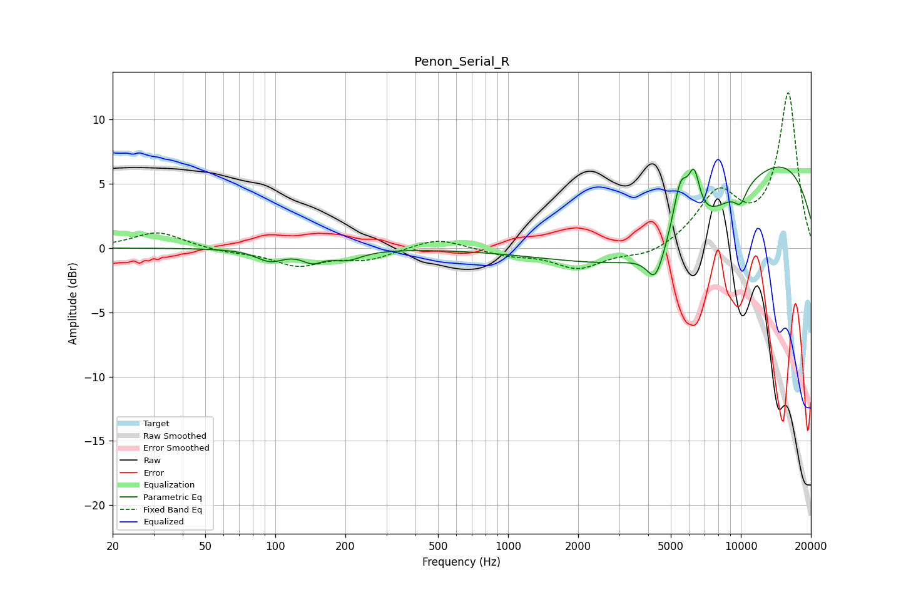

# Penon_Serial_R
See [usage instructions](https://github.com/jaakkopasanen/AutoEq#usage) for more options and info.

### Parametric EQs
Apply preamp of -6.4 dB when using parametric equalizer.

|   # | Type    |   Fc (Hz) |    Q |   Gain (dB) |
|-----|---------|-----------|------|-------------|
|   1 | Peaking |        95 | 2.36 |        -0.8 |
|   2 | Peaking |        98 | 2.58 |        -0.1 |
|   3 | Peaking |       145 | 3.15 |        -0.8 |
|   4 | Peaking |       203 | 2.15 |        -0.8 |
|   5 | Peaking |      4292 | 3.94 |        -2.3 |
|   6 | Peaking |      5139 | 0.38 |        -7.9 |
|   7 | Peaking |      5508 | 4.12 |         4.2 |
|   8 | Peaking |      6301 | 5.49 |         3.5 |
|   9 | Peaking |      9965 | 4.69 |        -1.2 |
|  10 | Peaking |     10000 | 0.24 |         9.9 |

### Fixed Band EQs
When using fixed band (also called graphic) equalizer, apply preamp of **-12.2 dB** (if available) and set gains manually with these parameters.

|   # | Type    |   Fc (Hz) |    Q |   Gain (dB) |
|-----|---------|-----------|------|-------------|
|   1 | Peaking |        31 | 1.41 |         1.3 |
|   2 | Peaking |        62 | 1.41 |        -0.3 |
|   3 | Peaking |       125 | 1.41 |        -1.3 |
|   4 | Peaking |       250 | 1.41 |        -0.8 |
|   5 | Peaking |       500 | 1.41 |         0.8 |
|   6 | Peaking |      1000 | 1.41 |        -0.5 |
|   7 | Peaking |      2000 | 1.41 |        -1.6 |
|   8 | Peaking |      4000 | 1.41 |        -0.7 |
|   9 | Peaking |      8000 | 1.41 |         4   |
|  10 | Peaking |     16000 | 1.41 |        12   |

### Graphs

