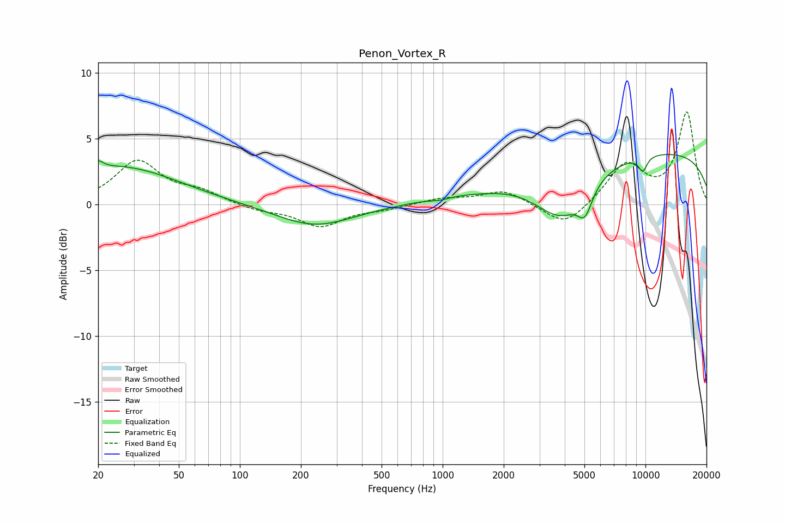

# Penon_Vortex_R
See [usage instructions](https://github.com/jaakkopasanen/AutoEq#usage) for more options and info.

### Parametric EQs
Apply preamp of -3.9 dB when using parametric equalizer.

|   # | Type    |   Fc (Hz) |    Q |   Gain (dB) |
|-----|---------|-----------|------|-------------|
|   1 | Peaking |        20 | 5.72 |         0.6 |
|   2 | Peaking |        25 | 0.49 |         2.9 |
|   3 | Peaking |       233 | 0.74 |        -1.7 |
|   4 | Peaking |       968 | 2.76 |        -0.2 |
|   5 | Peaking |       972 | 1    |         0.3 |
|   6 | Peaking |      1851 | 1.45 |         0   |
|   7 | Peaking |      3831 | 1.06 |        -3.8 |
|   8 | Peaking |      5035 | 3.91 |        -1.9 |
|   9 | Peaking |      9704 | 5.83 |        -1.1 |
|  10 | Peaking |     10000 | 0.18 |         4.1 |

### Fixed Band EQs
When using fixed band (also called graphic) equalizer, apply preamp of **-7.1 dB** (if available) and set gains manually with these parameters.

|   # | Type    |   Fc (Hz) |    Q |   Gain (dB) |
|-----|---------|-----------|------|-------------|
|   1 | Peaking |        31 | 1.41 |         3.2 |
|   2 | Peaking |        62 | 1.41 |         0.8 |
|   3 | Peaking |       125 | 1.41 |        -0.4 |
|   4 | Peaking |       250 | 1.41 |        -1.6 |
|   5 | Peaking |       500 | 1.41 |        -0.3 |
|   6 | Peaking |      1000 | 1.41 |         0.4 |
|   7 | Peaking |      2000 | 1.41 |         1.1 |
|   8 | Peaking |      4000 | 1.41 |        -1.8 |
|   9 | Peaking |      8000 | 1.41 |         3   |
|  10 | Peaking |     16000 | 1.41 |         6.9 |

### Graphs

