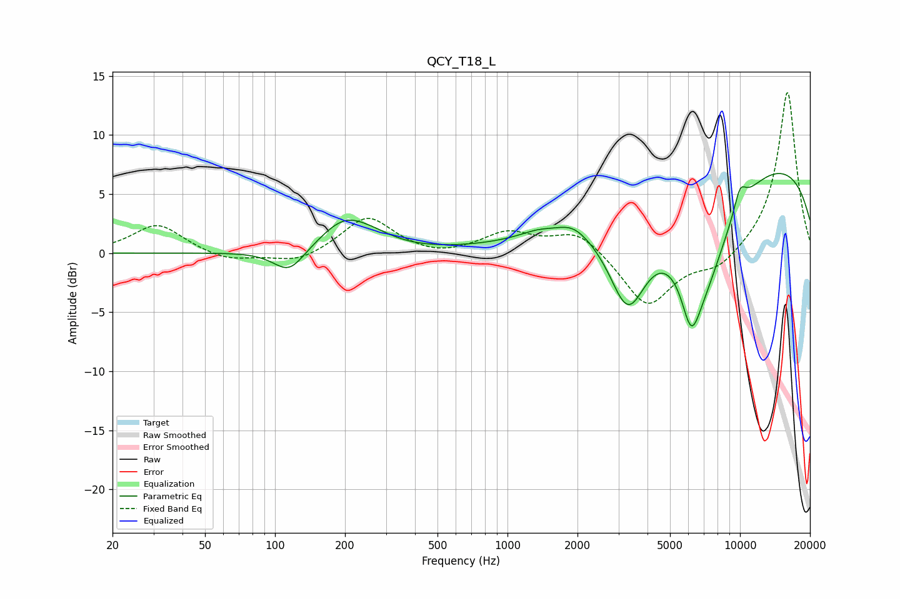

# QCY_T18_L
See [usage instructions](https://github.com/jaakkopasanen/AutoEq#usage) for more options and info.

### Parametric EQs
Apply preamp of -6.8 dB when using parametric equalizer.

|   # | Type    |   Fc (Hz) |    Q |   Gain (dB) |
|-----|---------|-----------|------|-------------|
|   1 | Peaking |       115 | 2.1  |        -2.1 |
|   2 | Peaking |       200 | 1.31 |         2.7 |
|   3 | Peaking |       269 | 1.57 |         0.5 |
|   4 | Peaking |      1341 | 1.95 |         0.4 |
|   5 | Peaking |      1904 | 2.19 |         0.8 |
|   6 | Peaking |      3292 | 1.6  |        -8.1 |
|   7 | Peaking |      6161 | 3.44 |        -4.2 |
|   8 | Peaking |      6882 | 1.05 |        -9.4 |
|   9 | Peaking |      9988 | 0.19 |         8.6 |
|  10 | Peaking |     10000 | 4.45 |         1.9 |

### Fixed Band EQs
When using fixed band (also called graphic) equalizer, apply preamp of **-13.7 dB** (if available) and set gains manually with these parameters.

|   # | Type    |   Fc (Hz) |    Q |   Gain (dB) |
|-----|---------|-----------|------|-------------|
|   1 | Peaking |        31 | 1.41 |         2.5 |
|   2 | Peaking |        62 | 1.41 |        -0.7 |
|   3 | Peaking |       125 | 1.41 |        -0.9 |
|   4 | Peaking |       250 | 1.41 |         3.1 |
|   5 | Peaking |       500 | 1.41 |        -0.4 |
|   6 | Peaking |      1000 | 1.41 |         1.7 |
|   7 | Peaking |      2000 | 1.41 |         1.9 |
|   8 | Peaking |      4000 | 1.41 |        -4.6 |
|   9 | Peaking |      8000 | 1.41 |        -1.4 |
|  10 | Peaking |     16000 | 1.41 |        13.8 |

### Graphs

