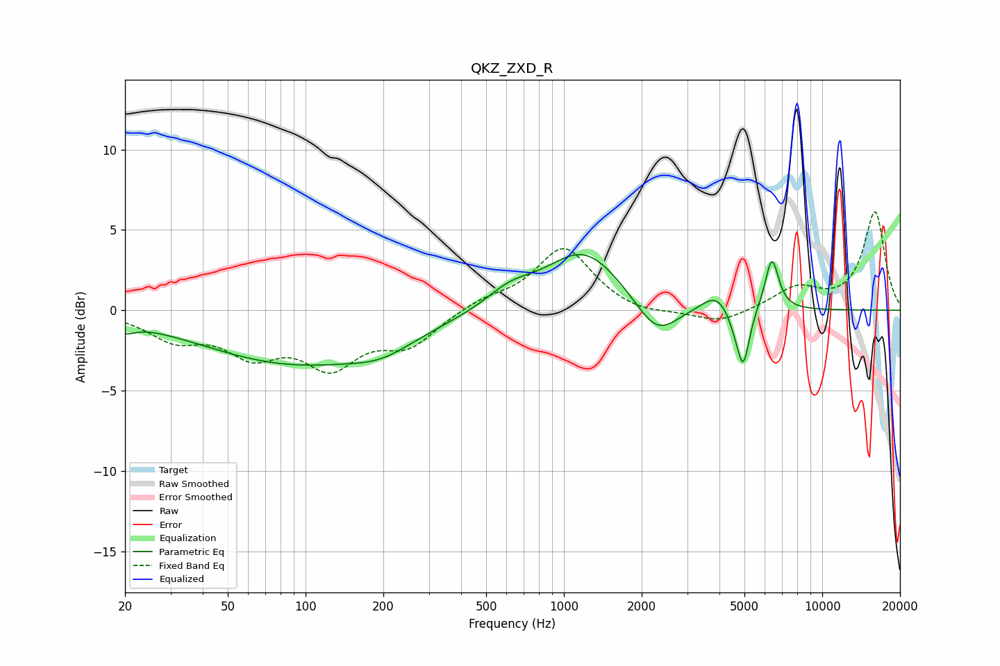

# QKZ_ZXD_R
See [usage instructions](https://github.com/jaakkopasanen/AutoEq#usage) for more options and info.

### Parametric EQs
Apply preamp of -3.6 dB when using parametric equalizer.

|   # | Type    |   Fc (Hz) |    Q |   Gain (dB) |
|-----|---------|-----------|------|-------------|
|   1 | Peaking |        20 | 3.79 |        -0.6 |
|   2 | Peaking |        93 | 0.38 |        -3.3 |
|   3 | Peaking |       197 | 1.23 |        -0.8 |
|   4 | Peaking |       617 | 1.53 |         1   |
|   5 | Peaking |      1195 | 0.95 |         3.7 |
|   6 | Peaking |      2288 | 1.68 |        -2.3 |
|   7 | Peaking |      3919 | 2.46 |         1.2 |
|   8 | Peaking |      4649 | 4.04 |        -1.1 |
|   9 | Peaking |      4956 | 6    |        -3.2 |
|  10 | Peaking |      6384 | 5.22 |         3.2 |

### Fixed Band EQs
When using fixed band (also called graphic) equalizer, apply preamp of **-6.2 dB** (if available) and set gains manually with these parameters.

|   # | Type    |   Fc (Hz) |    Q |   Gain (dB) |
|-----|---------|-----------|------|-------------|
|   1 | Peaking |        31 | 1.41 |        -1.6 |
|   2 | Peaking |        62 | 1.41 |        -2.4 |
|   3 | Peaking |       125 | 1.41 |        -3.1 |
|   4 | Peaking |       250 | 1.41 |        -2   |
|   5 | Peaking |       500 | 1.41 |         0.6 |
|   6 | Peaking |      1000 | 1.41 |         3.9 |
|   7 | Peaking |      2000 | 1.41 |        -0.4 |
|   8 | Peaking |      4000 | 1.41 |        -0.8 |
|   9 | Peaking |      8000 | 1.41 |         1.3 |
|  10 | Peaking |     16000 | 1.41 |         6.1 |

### Graphs

