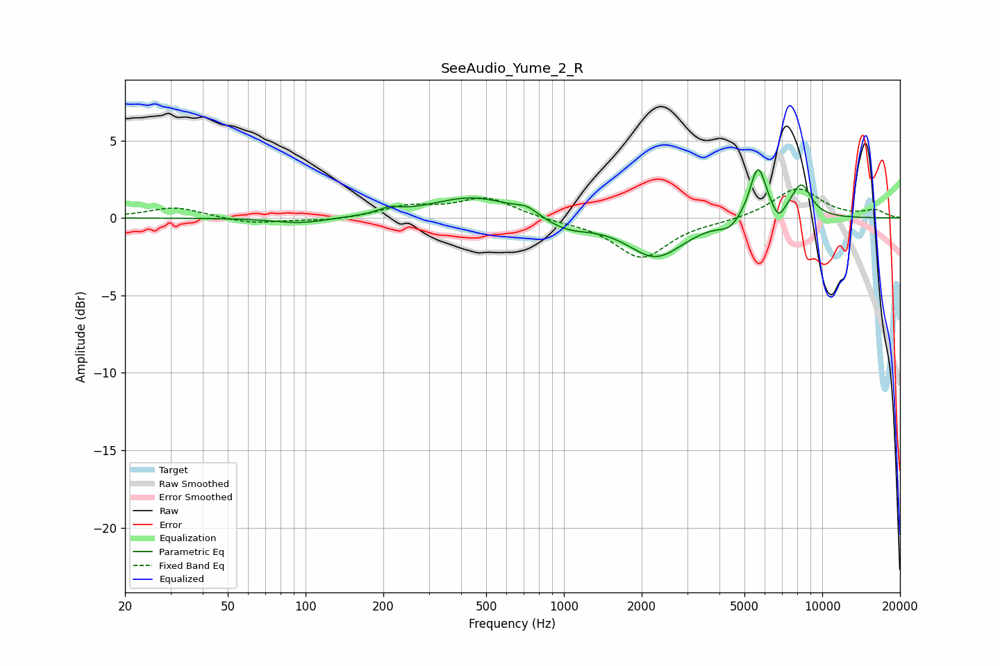

# SeeAudio_Yume_2_R
See [usage instructions](https://github.com/jaakkopasanen/AutoEq#usage) for more options and info.

### Parametric EQs
Apply preamp of -3.2 dB when using parametric equalizer.

|   # | Type    |   Fc (Hz) |    Q |   Gain (dB) |
|-----|---------|-----------|------|-------------|
|   1 | Peaking |        96 | 1.36 |        -0.4 |
|   2 | Peaking |       211 | 3.52 |         0.4 |
|   3 | Peaking |       446 | 0.88 |         1.4 |
|   4 | Peaking |       719 | 3.3  |         0.5 |
|   5 | Peaking |      1025 | 1.52 |        -0.8 |
|   6 | Peaking |      2265 | 1.29 |        -2.5 |
|   7 | Peaking |      4368 | 3.56 |        -0.6 |
|   8 | Peaking |      5641 | 4.32 |         3.4 |
|   9 | Peaking |      6774 | 6    |        -0.9 |
|  10 | Peaking |      8295 | 3.31 |         2.1 |

### Fixed Band EQs
When using fixed band (also called graphic) equalizer, apply preamp of **-2.0 dB** (if available) and set gains manually with these parameters.

|   # | Type    |   Fc (Hz) |    Q |   Gain (dB) |
|-----|---------|-----------|------|-------------|
|   1 | Peaking |        31 | 1.41 |         0.7 |
|   2 | Peaking |        62 | 1.41 |        -0.4 |
|   3 | Peaking |       125 | 1.41 |        -0.2 |
|   4 | Peaking |       250 | 1.41 |         0.7 |
|   5 | Peaking |       500 | 1.41 |         1.3 |
|   6 | Peaking |      1000 | 1.41 |        -0.2 |
|   7 | Peaking |      2000 | 1.41 |        -2.6 |
|   8 | Peaking |      4000 | 1.41 |        -0.2 |
|   9 | Peaking |      8000 | 1.41 |         1.9 |
|  10 | Peaking |     16000 | 1.41 |         0.5 |

### Graphs

