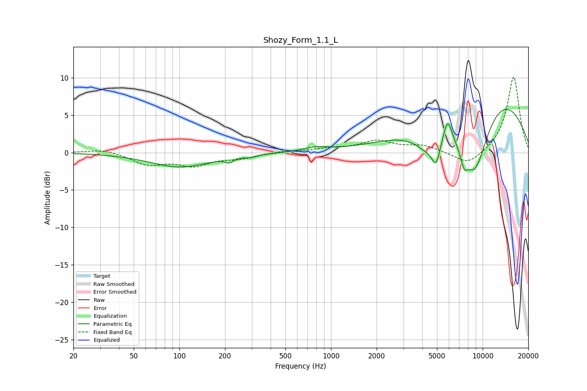

# Shozy_Form_1.1_L
See [usage instructions](https://github.com/jaakkopasanen/AutoEq#usage) for more options and info.

### Parametric EQs
Apply preamp of -5.9 dB when using parametric equalizer.

|   # | Type    |   Fc (Hz) |    Q |   Gain (dB) |
|-----|---------|-----------|------|-------------|
|   1 | Peaking |       101 | 0.71 |        -1.9 |
|   2 | Peaking |       213 | 5.96 |        -0.6 |
|   3 | Peaking |       295 | 3.42 |        -0.3 |
|   4 | Peaking |       790 | 1.88 |         0.5 |
|   5 | Peaking |      4468 | 1.41 |        -3.2 |
|   6 | Peaking |      4931 | 5.33 |        -2.7 |
|   7 | Peaking |      5877 | 4.57 |         3.4 |
|   8 | Peaking |      7533 | 5.99 |        -1.8 |
|   9 | Peaking |      8821 | 1.08 |       -12.7 |
|  10 | Peaking |     10000 | 0.36 |        11.4 |

### Fixed Band EQs
When using fixed band (also called graphic) equalizer, apply preamp of **-10.2 dB** (if available) and set gains manually with these parameters.

|   # | Type    |   Fc (Hz) |    Q |   Gain (dB) |
|-----|---------|-----------|------|-------------|
|   1 | Peaking |        31 | 1.41 |         0.5 |
|   2 | Peaking |        62 | 1.41 |        -1.5 |
|   3 | Peaking |       125 | 1.41 |        -1.6 |
|   4 | Peaking |       250 | 1.41 |        -0.6 |
|   5 | Peaking |       500 | 1.41 |         0.2 |
|   6 | Peaking |      1000 | 1.41 |         0.5 |
|   7 | Peaking |      2000 | 1.41 |         1.4 |
|   8 | Peaking |      4000 | 1.41 |         0.9 |
|   9 | Peaking |      8000 | 1.41 |        -1.8 |
|  10 | Peaking |     16000 | 1.41 |        10.2 |

### Graphs

